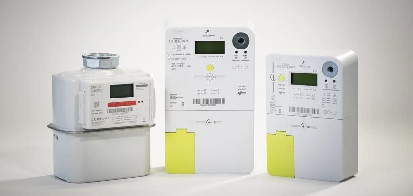

# Introduction

As of July 2019 Fluvius has been installing digital meters and must install at least 80% of the digital meters by December 31, 2024. By July 2029, all families and SMEs must have a digital meter.

As of January 2021 the constitutional Court has decided these digital meters will not be subtracting produced energy with solar panels from consumed energy from the net. Instead you will need a new contract with your energy supplier for delivery of energy to het net.

Now more then ever it is in everybody's interest to monitor your energy consumption and if possible automate your home for optimal use of energy.

<!-- TODO: Add image of energy saving by smart home -->

This is where the **Connected Digital Energy Meter - CDEM** device comes into play. It allows you to extract your utility meter data from the devices (digital electricity and gas meters) and put it to better use.

Our two main goals are

1. To learn from the data and allow you as a user to adapt your behavior to make optimal use of your energy
2. Make your home smarter and allow your household appliances to make use of the surplus energy at the appropriate time.

In that context we are providing this open source information to building a connected digital energy meter intended to support the do-it-yourself community and manufacturers in reading the data from a P1 port on the Fluvius digital meter. From there on the data is published to an MQTT broker, allowing it to be visualized in a dashboard or even integrated into an (existing) demotics system, making it possible to automate your energy usage at the most appropriate time.

The CDEM system will allow you to **leverage your digital meter into an actual smart meter**.

::: tip 🚀 Activating the P1 port
Before you are able to use the P1 port of your Fluvius smart meter, it has to be **activated**. This process is described in [Connecting to the Fluvius meter](/06_connect).
:::
