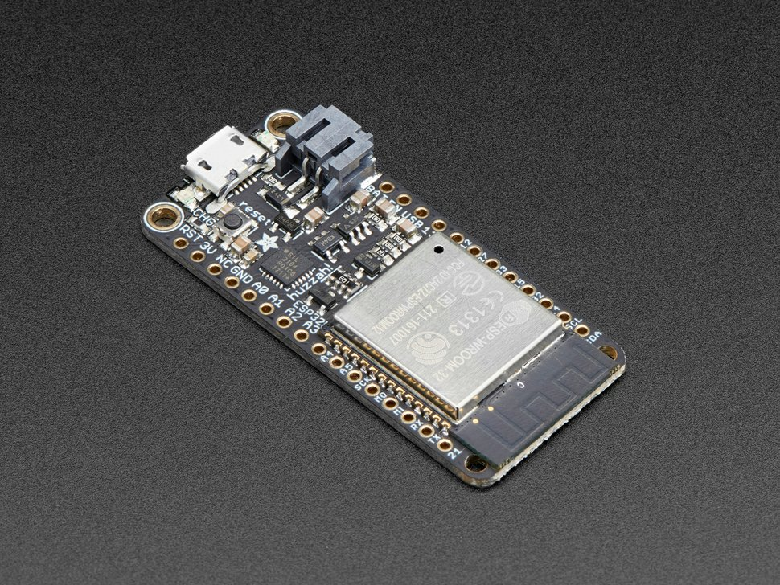
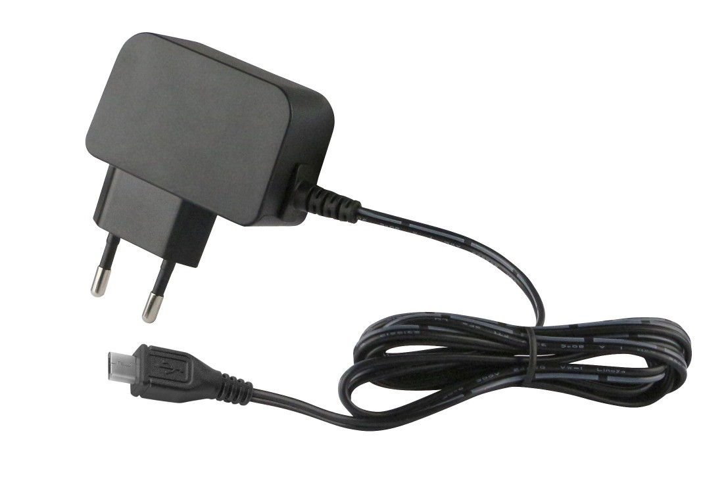
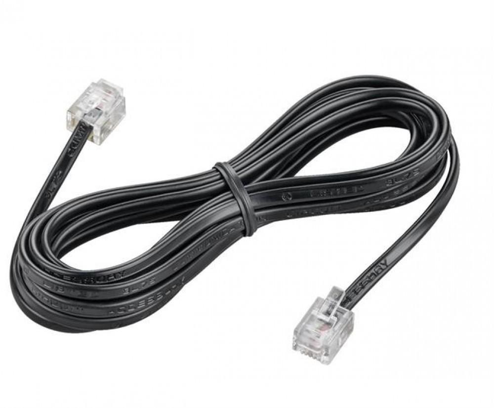

# Content

<!-- TODO - Add a picture here of all the components layed out -->

## Parts

This section contains a listing of all the components and tools required to setup your very own Connected Digital Energy Meter device.

### PCB Components

The next table provides an overview of the required components to assemble the Connected Digital Energy Meter shield for the ESP32 Huzzah32.

| Description | Part | PCB Designator | Quantity | Farnell Order Code | Key Properties |
| :---: | :---: |  :---: |  :---: |  :---: |  :---: |
| Hex Inverter | 74HCT14D | `U1` | 1 | [1201304](https://be.farnell.com/nexperia/74hct14d/74hct-cmos-smd-74hct14-soic14/dp/1201304) | 14 Pins SOIC |
| RJ11 Connector | 54601-906WPLF | `J4` | 1 | [2135977](https://be.farnell.com/amphenol-icc-fci/54601-906wplf/modular-jack-tht-r-a-rj12-6p6c/dp/2135977) | Right Angle, Through Hole |
| 1k8 Resistor | MCWR08X1801FTL | `R2` | 1 | [2447595](https://be.farnell.com/multicomp/mcwr08x1801ftl/res-1k8-1-0-125w-0805-thick-film/dp/2447595) | SMD 0805 |
| 3k3 Resistor | ASC0805-3K3FT5 | `R3` | 1 | [2078957](https://be.farnell.com/tt-electronics-welwyn/asc0805-3k3ft5/res-3k3-1-0-125w-0805-thick-film/dp/2078957) | SMD 0805 |
| 10k Resistor | CR0805-FX-1002ELF | `R1`, `R10` - `R12` | 3 | [1612522](https://be.farnell.com/bourns/cr0805-fx-1002elf/res-10k-1-0-125w-0805-thick-film/dp/1612522) | SMD 0805 |
| 1k5 Resistor | CRG0805F1K5 | `R8`, `R9` | 2 | [3399596](https://be.farnell.com/neohm-te-connectivity/crg0805f1k5/res-1k5-1-0-125w-0805-thick-film/dp/3399596) | SMD 0805 |
| 1k Resistor | RK73H2ATTD1001F | `R4` - `R7` | 4 | [3548772](https://be.farnell.com/webapp/wcs/stores/servlet/ProductDisplay?catalogId=15001&langId=32&storeId=10154&urlLangId=32&productId=268867943) | SMD 0805 |
| RGB LED | ASMB-MTB0-0A3A2 | `LD1`, `LD2` | 2 | [2401105](https://be.farnell.com/broadcom-limited/asmb-mtb0-0a3a2/led-hb-rgb-0-09w-plcc-4/dp/2401105) | SMD, PLCC-4 |
| Tactile Switch | B3U-1000P | `SW1` | 1 | [1333652](https://be.farnell.com/omron/b3u-1000p/switch-spst-no-0-05a-12v-smd/dp/1333652) | SMD, SPST-NO |

::: tip Datasheets
While Farnell only allow SME's to order components, the part numbers are provided so you can easily look for alternatives. Make sure to consult the datasheets of the components when selecting alternative components. While resistors and such are not that critical, the pinouts of the connectors and IC's are. Also make sure to take the key properties into account.
:::

<!-- TODO - Provide another alternative ? -->

### Microcontroller

The brains of the Connected Digital Energy Meter system is the [Adafruit HUZZAH32 – ESP32 Feather Board](https://www.adafruit.com/product/3405), a cheap but versatile and widely supported microcontroller module.

While it can be directly ordered from [Adafruit](https://www.adafruit.com/product/3405), other distributors are also available. Just have your pick:

* [Antratek - HUZZAH32 – ESP32 Feather Board](https://www.antratek.be/huzzah32-esp32-feather-board)
* [Kiwi Electronics - HUZZAH32 – ESP32 Feather Board](https://www.kiwi-electronics.nl/adafruit-huzzah32-esp32-feather-board)
* [Digi-Key Electronics - HUZZAH32 – ESP32 Feather Board](https://www.digikey.be/product-detail/en/adafruit-industries-llc/3405/1528-2181-ND/7244967)

::: tip Huzzah32
When selecting another distributor make sure to select the exact same module as documented here. Other modules exists that are very similar but not compatible.
:::

### Power Supply

As a power supply you can use any 5V USB micro power adapter you have laying around from an old phone or Raspberry PI. Just make sure that the power adapter is rated for at least `500mA` and it has a USB micro connector.

Most web-shops have a cheap power supply adapter available:

* [Antratek - 5V USB Micro Power Adapter](https://www.antratek.be/microusb-adapter-5v-2a)
* [Kiwi Electronics - 5V USB Micro Power Adapter](https://www.kiwi-electronics.nl/raspberry-pi-voeding-5-1v-2-5a-wit-eu-uk-us-au-plug)
* [Digi-Key Electronics - 5V USB Micro Power Adapter](https://www.digikey.be/product-detail/en/cui-inc/SWI3-5-E-MUB/102-4481-ND/7784532)

### Connecting to the Digital Meter

Connecting the Connected Digital Energy Meter to the Fluvius Digital meter requires an RJ11 cable with 4 internal wires. These are typically used for telephone connections, so chances are you may have one lying around.

When ordering cables one of the cheapest distributors with the wides range of products is [AlleKabels](https://www.allekabels.nl/rj11-kabel/7399/1377759/rj11-kabel.html). A length of `0.5 meter` is more than enough.

::: warning Check Connections
Make sure that the RJ11 cable has 4 or 6 wires (actually RJ12 - also usable) and that both sides have the wires in the same order.
:::

## Tools

To assemble the shield PCB some tools are required. 

* Hotair solderingstation or solderingstation with a fine solderingpoint
* Solderingpaste or fine soldering tin
* Tweezers
* Magnifying glass (optional)
