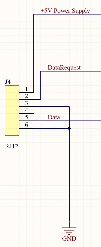
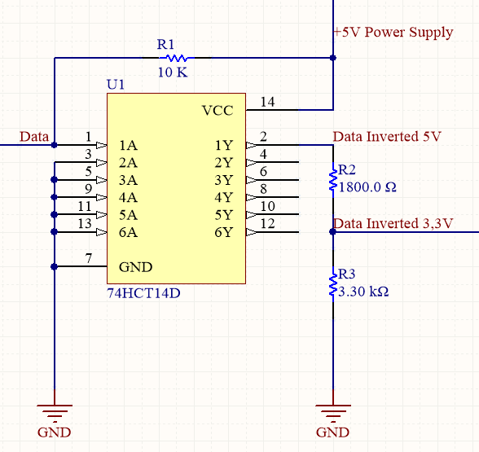
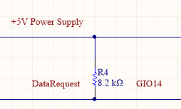
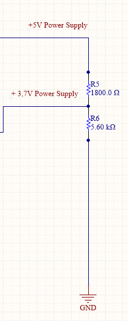

# Hardware for the communication module

Based on the knowledge from previous chapter we developed a PCB for the communication module with the ESP32 as it's microcontroller.

## Connection to the P1 port

Port 1 : +5V from the Fluvius meter , powering our module.
Port 2 : must be set high to request data
Port 3 : connected to the ground
Port 4 : not used
Port 5 : data transmission
Port 6 : connected to the ground

## Inverting the data signal

So we know that the data signal needs to be inverted and to be able to use that signal with a ESP32 it also needs to be converted to a 3,3V signal.

We used this circuit to handle the job :

::: danger Pending investigation
During the tests we had some problems with the 74HCT14D and replaced it with a xxxx. We still need to determin if the 74HCT14D is a valid option or not.
:::

## Sending a datarequest

In order to request data we will be using a output 14 of the ESP32 that is set high to enable data transmission and low to disable it.

## Powering the ESP32

To power the ESP32 we need to decrease the 5V to ± 3,7V by means of a voltage divider.

::: danger Pending investigation
We still need to confirm that the +5V from the Fluvius meter can power the complete board  of ower communication module. If not we will be forced to use a external +5V power supply.
:::

## PCB

From this circuit we build a PCB as a plugin module for the P1 port of the Fluvius meter.

There are no male RJ12 pcb mounted connectors so we had to get a bit creative here.

For the microcontroller we used the [Huzzah ESP32 feater](https://www.adafruit.com/product/3405).

## The design project

Here you can find the complete design project :

- [Circuit and pcb](https://circuitmaker.com/Projects/Details/RonnyMees/FluviusMeterv1)
- [Gerberfiles](/files/Fluvius_Meter_v1_Gerber.zip)
