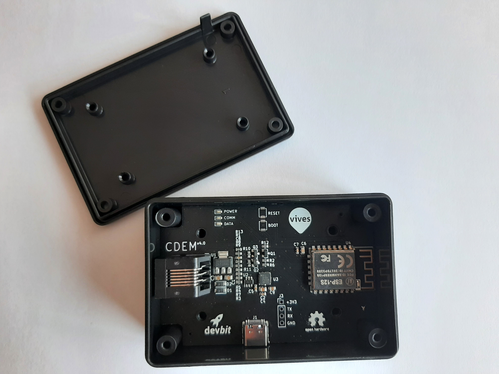

# Hardware

The **CDEM - Connected Digital Energy Meter** device is a standalone PCB that can be directly connected to a Belgian digital electricity meter. It can then read the P1 port of the digital meter and send that information to an MQTT broker.

<!-- TODO - Image of newest PCB + some margin around picture -->

The newer versions of the PCB (v4.0 and up) are stand-alone devices and require no external power source. They draw their power from the digital meter.

All hardware is open source and can be modified to fit your own needs. Feel free to download the [KiCad project files](https://github.com/connected-digital-energy-meter/cdem-hardware) at Github.

## Ordering Your Own CDEM

Due to the number of small components we advice you to order an assembled PCB, rather then solder it yourself.

When ordering your PCB you will need to upload the following information:

* Gerber files: [Github](https://github.com/connected-digital-energy-meter/cdem-hardware/tree/master/gerber)
* Bill of Material: [Github](https://github.com/connected-digital-energy-meter/cdem-hardware/tree/master/assembly)

### Suppliers

We can advice the following suppliers :

* [JLCPCB](https://jlcpcb.com/)
<figure class="video_container">
  <iframe src="https://jlcpcb.com/video/place.v2.mp4" frameborder="0" allowfullscreen="true"> </iframe>
</figure>
* [ALLPCB](https://www.allpcb.com/)
* [PCBWay](https://www.pcbway.com/)

## RJ12 Cable

Connecting the Connected Digital Energy Meter to the Fluvius Digital meter requires an RJ12 cable with 6 internal wires.

When ordering cables one of the cheapest distributors with the wides range of products is [AlleKabels](https://www.allekabels.nl/rj12-kabel/7400/1181351/telefoonkabel-rj12.html). You can choose the length according to your setup.

::: warning 🕵️ Check Connections
Make sure that the RJ12 cable has 6 wires and that both sides have the wires in the same order.
:::

## Casing

To safely take your Connected Digital Energy Meter in operation we recommend putting it into a casing. This protects the PCB from dust and such and also makes sure the electronics cannot be short circuited by accident.

A case that fits is the [1591XXM from HAMMOND](http://www.hammondmfg.com/pdf/1591XXM.pdf).

You can order this case on [Conrad](https://www.conrad.be/p/hammond-electronics-1591xxmsbk-1591xxmsbk-universele-behuizing-85-x-56-x-25-abs-zwart-1-stuks-485622).

You will need to make a small adjustment to the box, a small opening in the box for the RJ12 connector. You can do this with a small saw or cutter.
