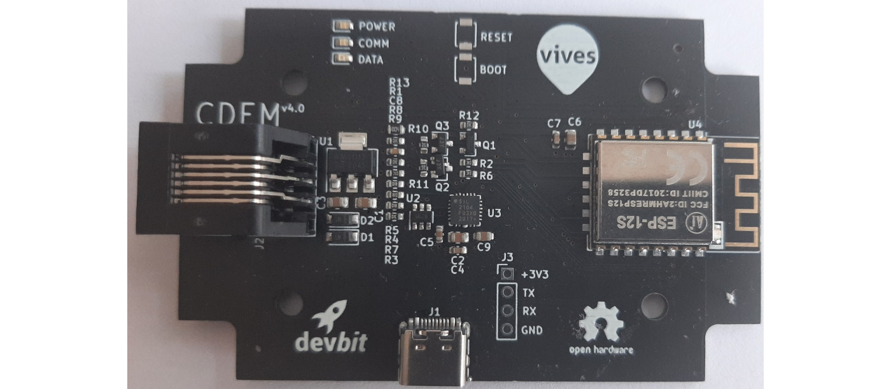

# Hardware

This chapter contains order and development information for the hardware of the Connected Digital Energy Meter device.

## CDEM pcb

We have developed a pcb to read the P1 port of the digital meter and send that information to a MQTT broker. Due to the number of small components we advice you to order a assembled pcb then rather solder it yourself.

### Ordering files

When ordering your pcb you will need to upload the following information:

* Gerber files : [Github](https://github.com/connected-digital-energy-meter/cdem-hardware/tree/master/gerber)
* Bill of Material : [Github](https://github.com/connected-digital-energy-meter/cdem-hardware/tree/master/assembly) 

### Suppliers

We can advice the following suppliers :

<!-- TODO: een lijst met mogelijke pcb leveranciers toevoegen -->
* supplier 1
* supplier 2
* supplier 3

## RJ12 cable 

Connecting the Connected Digital Energy Meter to the Fluvius Digital meter requires an RJ12 cable with 6 internal wires. 

When ordering cables one of the cheapest distributors with the wides range of products is [AlleKabels](https://www.allekabels.nl/rj12-kabel/7400/1181351/telefoonkabel-rj12.html). You can choose the length acording to your setup.

::: warning 🕵️ Check Connections
Make sure that the RJ12 cable has 6 wires and that both sides have the wires in the same order.
:::

## Box

To safely take your Connected Digital Enery Meter in operation we recemend putting it into a casing.

<!-- TODO: afbeelding van dit doosje -->

You can order the casing we used on [naam leverancier](...).

