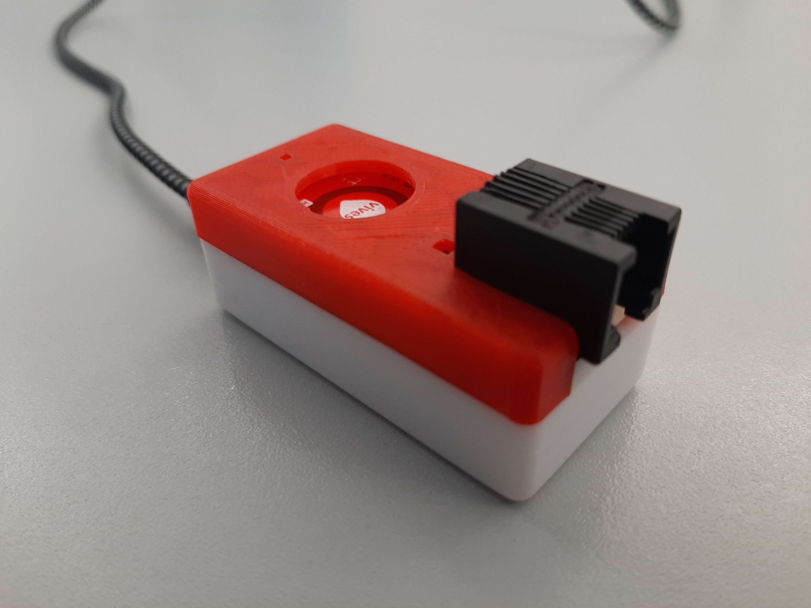

# Assembly of the kit

## Soldering the pcb

**Nico maak jij dit stuk?**

## Printing the housing

For the housing you have to print two part (top and bottom).
* [top](/files/top.stl)
* [bottom](/files/bottom.stl)

We advice you to print the parts in PLA material with standard parameters but without supports or rafts.

## Assemble the kit

**In stapjes via afbeeldingen**