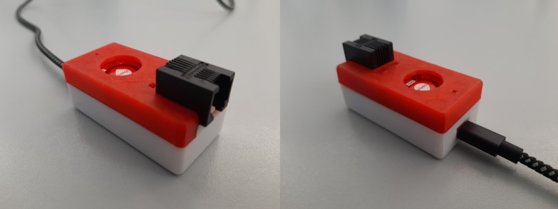

# Assembly

## Soldering the pcb

<!-- TODO - Place here a movie of the soldering procedure. -->

## Printing the housing

For the housing you have to print the following parts:

<!-- TODO - Place these files in a repo ?. -->

* [top](/files/top.stl) half of the housing
* [bottom](/files/bottom.stl) half of the housing

We advice you to print the parts in PLA material with standard parameters but without supports or rafts.

## Assemble the kit

Now just click the pcb you just made into the top 3D printed part and the ESP32 into the bottom 3D printed part (make sure the usb connector is at the side with the opening in the bottom part).

Finaly connect both parts by joining the pcb's headers.

