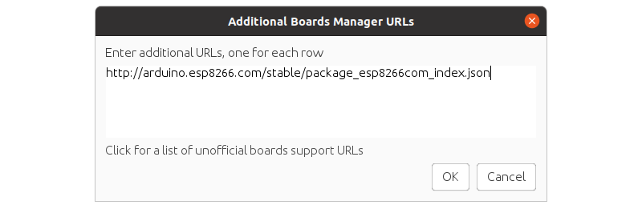
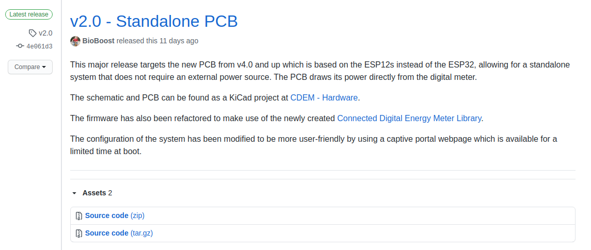
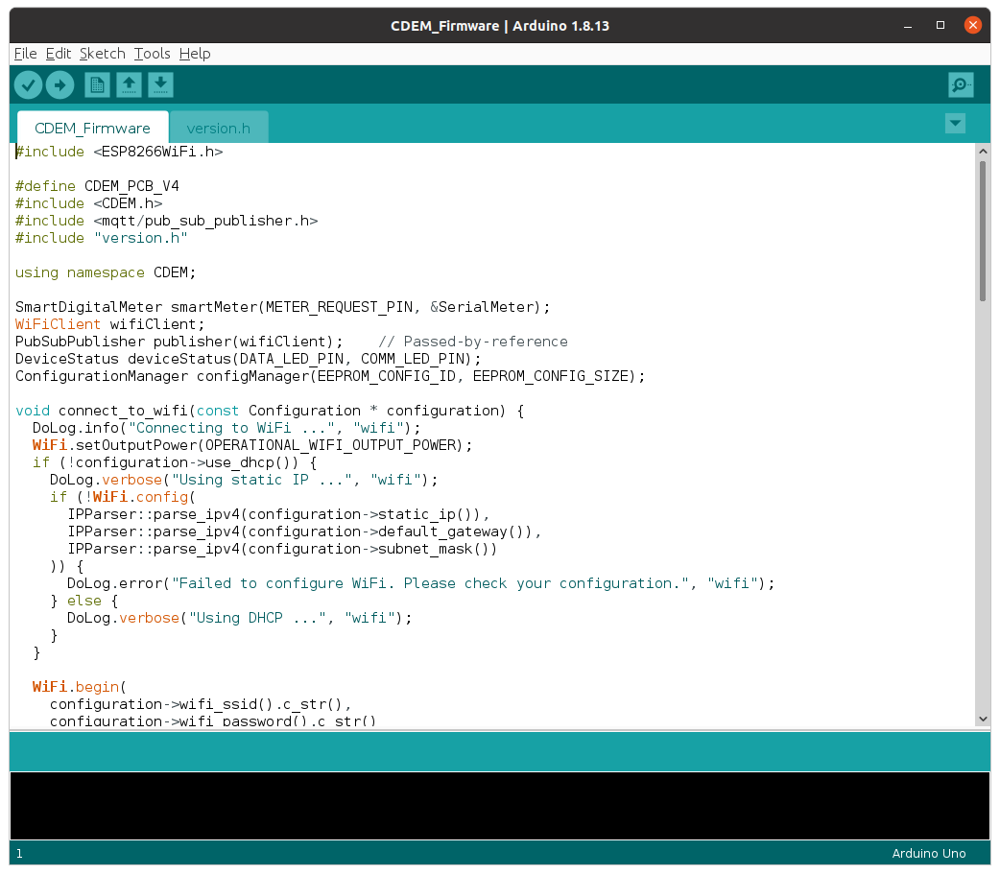
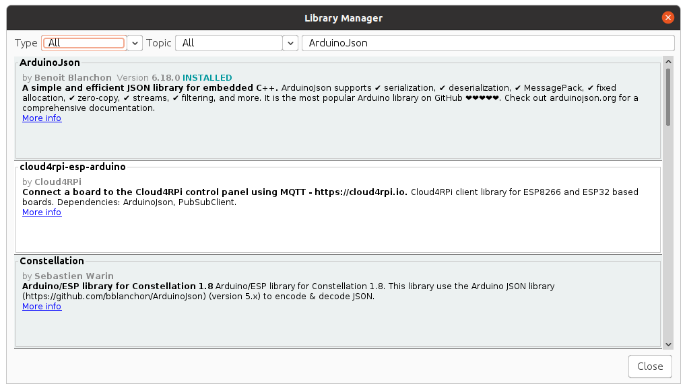
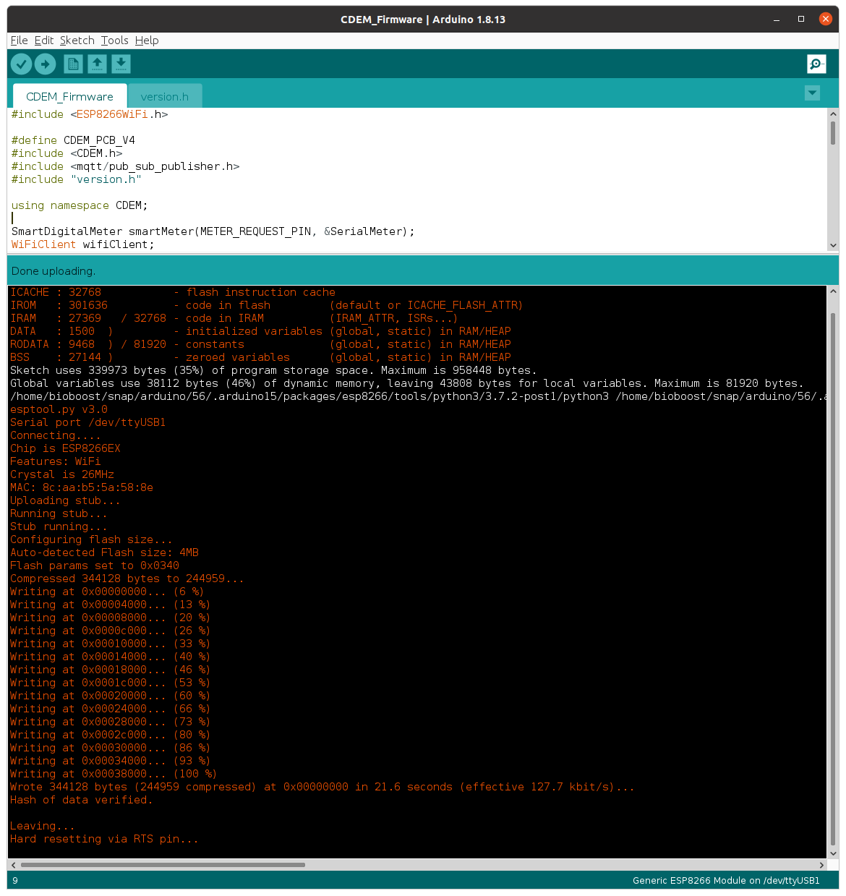

# Firmware

Now that you have your CDEM PCB, it is time to upload the firmware into the ESP12 chipset.

Connect the PCB to your computer using a USB-C cable and follow the guide below to flash the device with the latest firmware.

## Install Arduino IDE

In order to compile and flash the firmware for your CDEM device, you will need to install Arduino IDE.

Instructions on how to install this IDE for most operating systems can be found on the website of [Arduino](https://www.arduino.cc/en/Guide) itself.

Once installed, start the IDE to continue.

## Install ESP12 Board Package and Tools

Before any applications can be compiled for the ESP12, the board support package and tools need to be installed.

Navigate to `File => Preferences` and add the stable release link `http://arduino.esp8266.com/stable/package_esp8266com_index.json` to the **Additional Boards Manager URLs**. Multiple URLs can be added by clicking the small window icon next to the input field and using a URL per line.

Open `Tools => Board => Board Manager ...` and search for `esp8266`. Next install the `esp8266 by Community` (the CDEM firmware is tested with v3.0.0).

## Download the Latest Firmware

Download the latest firmware for the ESP12 from the [CDEM Firmware GitHub page](https://github.com/connected-digital-energy-meter/cdem-firmware/releases).

::: tip Latest Firmware
Make sure to download the latest firmware so you are up-to-date with the latest changes.

Not that the `v1.x` releases targeted the old hardware (using ESP32) while the newer `v2.x` and up releases target the standalone ESP12 system (PCB v4.0 and up).
:::

Under `Assets` you will find the ZIP file `cdem_firmware_vx_x_x.zip`.

<!-- TODO - Update screenshot to latest version -->

Extract the ZIP file somewhere on your system.

Open Arduino IDE and traverse to the location you extracted the ZIP file. Select the project and open it.

Now select the `Generic ESP8266 Module` board from the `Tools => Board => ESP8266 Boards` menu after installation. Select the correct `COM-port` from `Tools => Port`.

Next you will be required to install the different libraries the firmware depends on to do its work.

## Installing Required Libraries

Several libraries have to be installed in order for the firmware to be compiled. The following sections describe how each library can be installed.

::: tip 😺 Git
If you are familiar with git you can also clone the library repositories in your user home directory under `Arduino/libraries` and checkout the required release tags. The `Arduino/libraries` path is automatically included when the project is compiled.
:::

### The CDEM Library

The firmware for the ESP12 module you downloaded is only the tip of the iceberg. Most of the functionality of the firmware is provided by the `Connected Digital Energy Meter` library.

Download the latest release of the [Connected Digital Energy Meter library](https://github.com/connected-digital-energy-meter/connected-digital-energy-meter/releases) as a zip file and include it via `Sketch => Include Library => Add ZIP Library ...`.

<!-- TODO - Add screenshot here of release page -->

### The PubSubClient Library

PubSubClient is a client library for MQTT messaging.

1. Open the Arduino Library Manager via `Tools => Manage Libraries`
2. Search for `PubSubClient` (make sure to use the library by **Nick O'Leary**)
3. Select the version: `2.8.0`
4. Click install.

### The ArduinoJson Library

The ArduinoJson library allows easy parsing and conversion of JSON strings. The full payload of all the meter telemetry is transmitted as JSON.

1. Open the Arduino Library Manager via `Tools => Manage Libraries`
2. Search for `ArduinoJson` (make sure to use the library by **Benoit Blanchon**)
3. Select the version: `6.18.0`
4. Click install.

## Compile and Upload the Firmware

Make sure your CDEM is connected to your host PC via USB and that the correct port is selected.

Select the Upload button and watch the magic happen. If all went well you should get similar output to that shown below.

After a couple of seconds the device should start to output messages to the serial monitor and the green LED on the board should blink with an interval of about 2 seconds.

