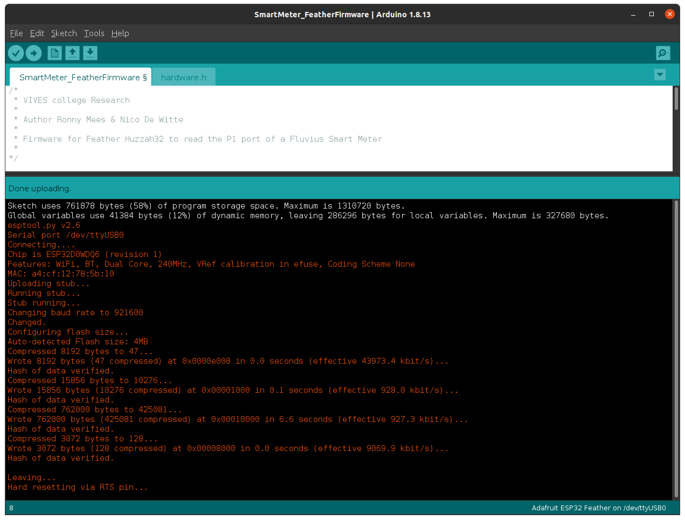

# Compiling and Flashing the Firmware

<!-- Maybe a nice image here of arduino ide with arrow to our PCB -->

## Install Arduino IDE

In order to compile and flash the firmware for your ESP32 you will need to install Arduino IDE. Instructions for most operating system can be found on the website of [Arduino](https://www.arduino.cc/en/Guide) itself.

## Download the Latest Firmware

Download the latest firmware for the ESP32 from the [CDEM Firmware GitHub page](https://github.com/connected-digital-energy-meter/cdem_firmware/releases). Extract the ZIP file somewhere on your system.

Open Arduino IDE and traverse to the location you extracted the ZIP file.

Next of you will be required to install the different libraries the firmware depends on to do its work.

## Install ESP32 board packages and tools

Start the Arduino IDE and navigate to `File => Preferences`.

Now add the stable release link `https://raw.githubusercontent.com/espressif/arduino-esp32/gh-pages/package_esp32_index.json` to the **Additional Boards Manager URLs**. Multiple URLs can be added by clicking the small window icon next to the input field and using a URL per line.

Open `Tools => Board => Board Manager ...` and search for `esp32`. Next install the `esp32 by Espressif Systems` (the firmware is tested with v1.0.4)

Last select the `Adafruit ESP32 Feather` board from the `Tools => Board => ESP32 Arduino` menu after installation

## Installing Required Libraries

Several libraries have to be installed in order for the firmware to be compiled. The following sections describe how each library can be installed.

::: tip 😺 Git
If you are familiar with git you can also clone the library repositories in your user home directory under `Arduino/libraries` and checkout the required release tags. The `Arduino/libraries` path is automatically included when the project is compiled.
:::

### Async MQTT client for ESP8266 and ESP32

The Async MQTT client library allows the firmware to connect to an MQTT broker and publish messages.

Download the `v0.8.1` release of the [Async MQTT Client library](https://github.com/marvinroger/async-mqtt-client/releases) as a zip file and include it via `Sketch => Include Library => Add ZIP Library ...`.

### Async TCP Library for ESP32 Arduino

The Async MQTT client depends on the Async TCP Library to setup a TCP connection with the broker.

Navigate to the GitHub page of the [Async TCP Library](https://github.com/me-no-dev/AsyncTCP) and click the **green** `Code` button. Select `Download ZIP` from the dropdown.

Include the ZIP file in Arduino IDE via `Sketch => Include Library => Add ZIP Library ...`.

### ArduinoJson

The ArduinoJson library allows easy parsing and conversion of JSON strings. The full payload of all the meter telemetry is transmitted as JSON. 

Follow the instructions below or [checkout the video of the author](https://www.youtube.com/watch?v=GUTpaY1YaXo&feature=youtu.be).

1. Open the Arduino Library Manager via `Tools => Manage Libraries`
2. Search for `ArduinoJson` (make sure to use the library by **Benoit Blanchon**)
3. Select the version: `6.17.3 `
4. Click install.

## Compile and Upload the Firmware

Now connect your ESP32 via USB. Select the correct `COM-port` from `Tools => Port` and compile and upload the firmware to the ESP32.

::: warning ⌨ Configuration
Keep the ESP32 connected and Arduino IDE running for a quick configuration of your firmware.
:::

If all went well you should get similar output to that shown below.

