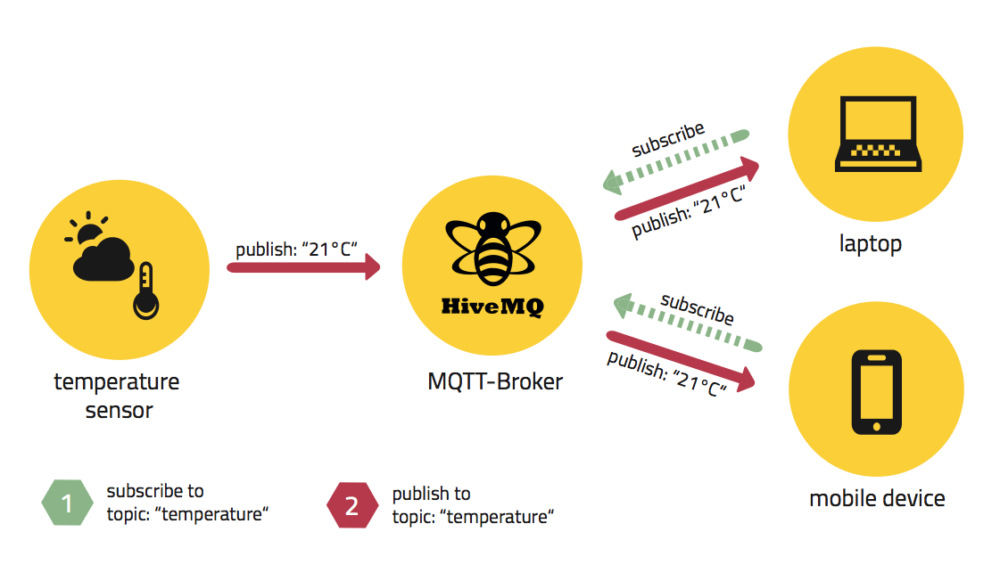
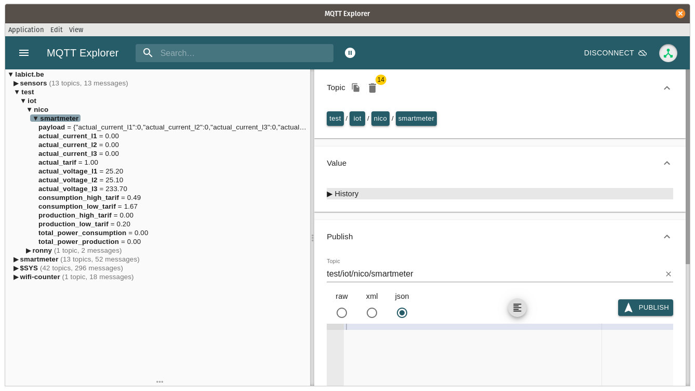

# MQTT

Before taking your CDEM in operation you have to provide a MQTT broker service in your local network.

## What is MQTT ?

MQTT is one of the most commonly used protocols for Internet of Things devices to communicate with each other. MQTT stands for Message Queuing Telemetry Transport. It is a very lightweight messaging protocol that uses a **publish / subscribe** mechanism to exchange data between different clients. It is small in size, low in power consumption and uses minimized data packages, ideal for machine-to-machine communication and therefor for the Internet of Things.

Lets consider the situation where we have temperature sensor that want to share its current data with other devices. On the other hand we have devices such as a smartphone or computer who want to receive this data to process it or display it in a dashboard.

To transport this data across devices, MQTT can be used in conjunction with a centralized service called the broker.

The data supplier will setup a connection with the broker and publish its data on what is called a **topic**, which is basically an identifier for the data.

Other services/devices that are interested in this particular data can then also connect to the same broker and **subscribe** on this topic, allowing them to receive the data.



So basically there are two things that happen:

* The sensor specifies a **topic** under which it will **publish** its data. For example `temperature`. Then it will publish its temperature value to this topic.
* Anyone who wants to receive the data can then **subscribe** to the topic `temperature`. Every time the sensor publishes new data, all subscribers are automatically notified of the new temperature value.

## How does CDEM use MQTT ?

The CDEM devices basically does the same thing as the aforementioned temperature sensor. It reads the energy data from the digital meter and publishes that data to an MQTT broker.

From that point on any other interested services (Home Assistant, openHAB, NodeRED, ...) can access the data. This of course within your own home network if you are not using a public broker (which we discourage anyway).

## Installing an MQTT broker service

[Mosquitto](https://mosquitto.org) is one of the brokers that can be used to communicate with MQTT. It's a simple and lightweight broker, and is available on many different platforms (Docker, Raspberry Pi, standalone, NAS, ...).

::: warning 🌍 Public Brokers
While its perfectly viable to use a publicly available broker such as `mqtt.eclipse.org` or `broker.hivemq.com`, we strongly discourage this approach as you will be sending your personal sensitive data to a public and open broker.
:::

### Linux Based Installation - Debian alike

If you have a Raspberry Pi with a Debian based system (Raspbian, Ubuntu, ...) or a Linux based server available in your network, the installation of Mosquitto is a walk in the park.

Installing Mosquitto on any Linux Debian based system is super easy. Just update your local package repositories and install the `mosquitto` package. For a basic setup such as ours, no further configuration is required.

```bash
sudo apt update
sudo apt install mosquitto
```

::: warning 💻 Static IP
Do make sure to install the Mosquitto broker on a system with a static or MAC-reserved IP address. It should not change otherwise the CDEM device will be unable to connect to the broker.
:::

### NAS System

Most NAS (Network Attached Storage) systems such as synology allow you to install services such as Mosquitto by the click of a button.

Since there are many systems out there we cannot provide a manual for each. However, it should not be too hard to find some information on the Internet on how to install an MQTT broker on your NAS.

### Docker

While docker is not a host device on its own, many systems (Linux Servers, NAS-systems, ...) allow easy deployment of docker containers.

If you have a docker environment on any of your network devices (server, NAS, ...) you can setup a Mosquitto broker by deploying a container of the [eclipse-mosquitto image](https://hub.docker.com/_/eclipse-mosquitto).

### Docker-compose - All in One

For a more advanced [all in one setup](/11_docker_compose) checkout the documentation on using docker-compose.

## Testing your MQTT broker service

Feel free to test your broker using a tool such as [MQTT Explorer](http://mqtt-explorer.com/). It's an MQTT client application that allows you to see all data passing by on your broker as well as allow you to publish messages on a topic.

Once your CDEM device is operational and configured, you should see its data pass by just as shown in the next screenshot.

