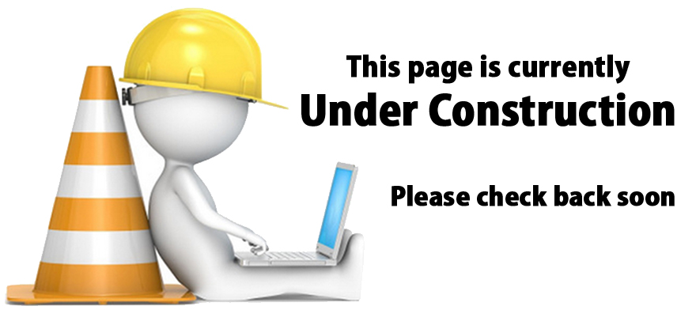

# Configuring your CDEM

<!-- TODO: volledig wijzigen naar de webinterface configuratie -->

Make sure you have the CDEM device connected to your host computer using a USB cable.

To alter the configuration of the device you will need a terminal emulator application such as the Arduino monitor `Tools => Serial Monitor` or [PuTTY](https://www.putty.org/).

Upon the first startup of the firmware the factory default settings are loaded and you automatically are redirected to the configuration wizard of the device.

If you do not see any output in your terminal emulator app, press the reset button on the CDEM device. Don't disconnect the device, it may close your terminal emulator app.

::: warning ✋ Configuration is Mandatory
Do note that the device will not boot past the configuration wizard for as long as the configuration is not altered and saved. This is a preliminary safety measure to protect your data and make sure you as an owner of the device has taken the time to configure the device.
:::

## Configuration Wizard

The configuration wizard allows a first time user to configure the device in an easy and straight-forward way. It will request all required configuration parameters to be specified, show examples and check if your input is correct. The default configuration can also be kept by just pressing `ENTER`.

::: tip Non-volatile memory
The configuration is saved in the flash of the microcontroller, a non-volatile memory region. This means that it will persist even if power is taken away from the device. Of course it can always be altered later on by you as a user. See [changing the configuration](#changing-the-configuration).
:::

### Network Settings

First the Configuration wizard will request your WiFi SSID and Password. This is required so the device can connect to your local network and therefore to the MQTT broker. The device does not make any attempt to the connect to the Internet unless you will use a public external broker.

Your password is also save inside the device and will never be made public. It is only used by the device itself. No services are running on the CDEM device that allow incoming connections.

::: tip 🖥 Arduino Serial Monitor
To supply information to the device, type your text in the top of the Arduino Serial Monitor and press enter to confirm.
::::

Next you will be asked if you want to use DHCP or not. If not, a static IP address, subnet mask and default gateway for your network communication will be requested. Since no communication to the CDEM device is required, we encourage you to use DHCP and allow your router in your home network to supply a dynamic IP address.

### MQTT Settings

Once your network has been configured you will be asked for the MQTT broker IP-address, port and base topic.

The IP address of your broker is the IP address of the device your broker is running on (NAS, server, Raspberry Pi, ...).

In most cases the port should be left to it's default of `1883` unless you configured the broker to use another port.

The base topic can any topic you choose. Topics can be hierarchical and sub-topics can be separated from each other using forward slashes `/`. Just make sure not to end or start your topic with a forward slash. Also document the topic somewhere, as you will need it later on.

### Meter Settings

Last but not least you will be asked how often you wish to publish the meter data. This can range from `1` second to `3600` seconds. The quicker you publish the data, the more granular your graphs will be able to display the data. However, it will also require more data storage. A good value is every `30` seconds.

### Confirmation

Once the wizard has been completed you will be presented with the full configuration of the device and you will be requested to confirm your settings. Answering `y` will save the settings and reboot the device while answering `n` will restart the configuration wizard.

## Changing the Configuration

Changing the device settings can only be done in the 10 second window while the device is booting by holding your finger to the VIVES logo on the PCB (capacitive touch pad). You can restart the device anytime by pressing the small reset button on the PCB (a small toothpick hole is provisioned in the casing).

In this 10 second window the device will output a count-down via the serial port and blink both LED's blue.

Once the touch has been detected, the boot menu and the current device configuration will be outputted to the serial port and you can alter all the settings similar to a computer BIOS.

The menu will also allow you to start the configuration wizard or reset the device to factory default settings.

::: warning 🏭 Factory Default
If you ever lend the device or give it to someone else, make sure to reset the device to its factory default settings.
:::

## Configuration Settings Reference

* **WiFi SSID**: The SSID (Service Set IDentifier) of an access point in your local home network that the CDEM device can use to connect to your network and MQTT broker.

* **WiFi password**: The password to connect to your local network.

* **Use DHCP or not**: If you use DHCP (Dynamic Host Configuration Protocol) the CDEM device gets it's network settings automatically from your router/access point. If you want to configure those settings yourself, don't use DHCP.

* **Static IP**: The IP address you want your CDEM device to use in your network. Check your network configuration before assigning this so you do not create conflicts with other network devices.

* **Subnet Mask**: The subnet mask for the device to use in case you assign it a static IP address.

* **Default gateway**: The IP address to use as a default gateway. This should be the internal IP address of your local router.

* **MQTT broker IP Address**: This is the IP Address of the MQTT broker the CDEM device should use to publish your data to.

* **MQTT broker port**: This is the port used to communicate with the MQTT broker. Usually this is port `1883`.

* **MQTT broker base topic**: Your meter data is published to a topic on the MQTT broker. The topic can use some hierarchical levels by separating sub-topics using a forward slash. Different devices usually publish their data on different topics. The factory default for the base topic is `iot/myhome/cdem`.

* **Read Period**: The device will periodically read the data from the P1 port and publish it to the selected MQTT broker. The time between different reads can be configured between `1` and `3600` seconds.
