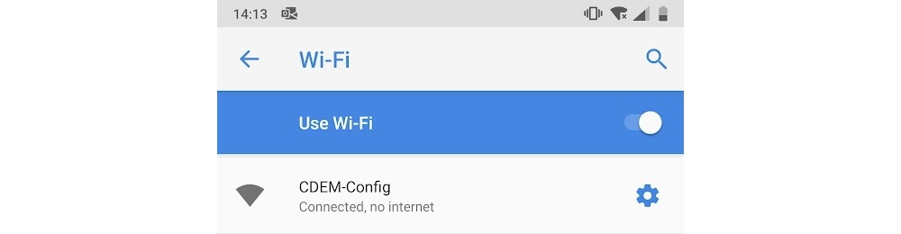
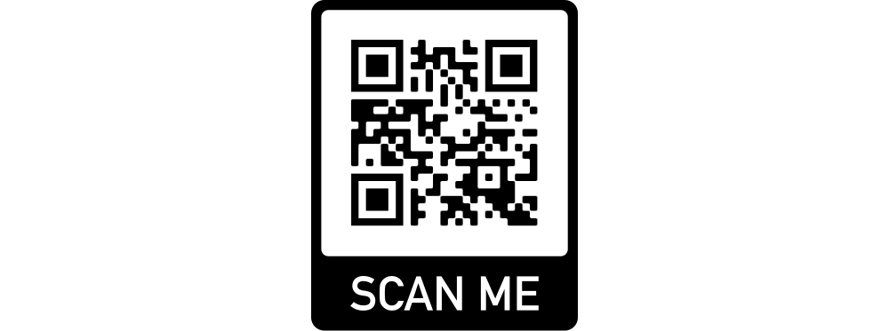
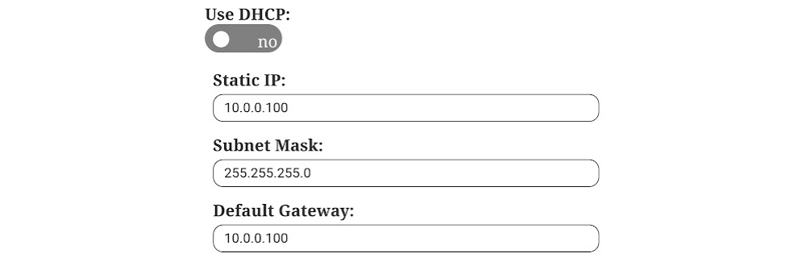

# Configuring your CDEM

Upon the first startup of the firmware, the factory default settings are loaded. These default settings need to be altered to suit your own home network configuration before the device will function correctly.

::: warning ✋ Configuration is Mandatory
In its initial state, the device will not boot past the point of setting up the access point. This because your network information is required, before the datagrams can be published to an MQTT broker. This is also a preliminary safety measure to protect your data and make sure you as an owner of the device have taken the time to configure the device.
:::

The device will at least require the following information:

* Your WiFi SSID
* Your WiFi password
* An MQTT broker IP address

::: tip No Internet required
The device does not access the Internet in any way unless you are using a public MQTT broker. No information is send to any third party and no information is fetched for any purposes. The device also does not allow any external connection to be made to the device itself, except for the configuration procedure at boot.
:::

## Accessing the Configuration Page

Make sure you have the CDEM device connected to your host computer using a USB-C cable.

::: warning More power
In some cases the CDEM device will draw a bit more power than allowed by the Fluvius digital meter when configuring the device (as it sets up a WiFi access point). Because of this we recommend connecting the device to a computer via USB or using a smartphone power adapter when configuring the device.
:::

The device can be configured by connecting to the access point provided by the device on boot-up using a smartphone or computer. This access point will only be **available for a limited time of 5 minutes**. If the configuration page is not accessed within the time window the device will boot using its current configuration.

To connect to the access point, reboot the device by disconnecting and connecting it back to the power supply. Once the **COMM LED** slowly fades in and out, the access point should be available.

<!-- TODO - Animated gif of fading comm led -->

Use the information below to connect to the access point:

* **WiFi SSID:** `CDEM-Config`
* **WiFi Password:** `smartmeter`

You should now be able to open a browser and navigate to the configuration page located at [http://172.16.10.1](http://172.16.10.1). This can also be accomplished by scanning the QR code below.

If the connection to the configuration page fails to load, check your connection to the access point. If for some reason the connection is lost, you may need to reboot the device as the 5 minute window may have passed.

Once the configuration page is loaded, you have all the time in the world to complete the configuration as the access point will be kept operational until you reboot the device or save the configuration.

<!-- TODO - Take new screenshot with default configuration -->

## Configuring the Device

To configure the device, just alter the current settings. All settings are validated before they are saved to the internal device memory.

<!-- TODO - Bricked device => reflash -->

### Network Settings

The first configuration parameters involve your **network settings**. This is required so the device can connect to your local network and therefore to the MQTT broker. The device does not make any attempt to the connect to the Internet unless you use a public external broker, which is highly discouraged.

Your password is also saved inside the device and will never be made public. It is only used by the device itself. No services are running on the CDEM device that allow incoming connections except for the configuration portal.

Next you will be able to select to **use DHCP or not**. If not, you will need to provide a static IP address, subnet mask and default gateway for your network communication. Since no communication to the CDEM device is required, we encourage you to use DHCP and allow your router in your home network to supply a dynamic IP address.

### MQTT Settings

Next you will need to configure your MQTT broker IP-address, port and base topic.

The IP address of your broker is the IP address of the device your broker is running on (NAS, server, Raspberry Pi, ...).

In most cases the port should be left to it's default of `1883` unless you configured the broker to use another port.

The base topic can any topic you choose. Topics can be hierarchical and sub-topics can be separated from each other using forward slashes `/`. Just make sure not to end or start your topic with a forward slash. Also document the topic somewhere, as you will need it later on.

### Meter Settings

Last but not least can change how often you wish to publish the meter data. This can range from `1` second to `3600` seconds. The quicker you publish the data, the more granular your graphs will be able to display the data. However, it will also require more data storage. A good value is every `30` seconds.

### Saving

Once you are satisfied with your configuration, you can save the settings in the memory of the device by clicking the `Save` button.

If all goes well, the device will save the settings and continue the boot process.

<!-- TODO - Screenshot of ok page -->

## Altering the Configuration

Changing the device settings can be done at any point. All you need to do is:

1. Connect the device to a computer of smartphone adapter.
2. Reboot the device.
3. Connect to the access point `CDEM-Config` with the password `smartmeter`.
4. Traverse to the configuration page: [http://172.16.10.1](http://172.16.10.1)
5. Alter the configuration settings.
6. Save the settings using `Save` or discard the changes using `Cancel`.

::: warning 🏭 Factory Default
If you ever lend the device or give it to someone else, make sure to reset the device to its factory default settings. This can be achieved by accessing the configuration portal and hitting the `Factory Defaults` button.
:::

## Configuration Settings Reference

* **WiFi SSID**: The SSID (Service Set IDentifier) of an access point in your local home network that the CDEM device can use to connect to your network and MQTT broker.

* **WiFi password**: The password to connect to your local network.

* **Use DHCP or not**: If you use DHCP (Dynamic Host Configuration Protocol) the CDEM device gets it's network settings automatically from your router/access point. If you want to configure those settings yourself, don't use DHCP.

* **Static IP**: The IP address you want your CDEM device to use in your network. Check your network configuration before assigning this so you do not create conflicts with other network devices.

* **Subnet Mask**: The subnet mask for the device to use in case you assign it a static IP address.

* **Default gateway**: The IP address to use as a default gateway. This should be the internal IP address of your local router.

* **MQTT broker IP Address**: This is the IP Address of the MQTT broker the CDEM device should use to publish your data to.

* **MQTT broker port**: This is the port used to communicate with the MQTT broker. Usually this is port `1883`.

* **MQTT broker base topic**: Your meter data is published to a topic on the MQTT broker. The topic can use some hierarchical levels by separating sub-topics using a forward slash. Different devices usually publish their data on different topics. The factory default for the base topic is `iot/myhome/cdem`.

* **Read Period**: The device will periodically read the data from the P1 port and publish it to the selected MQTT broker. The time between different reads can be configured between `1` and `3600` seconds.
