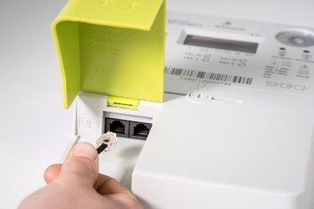

# Connecting to the Fluvius meter

## Activate the Fluvius meter

You have to fill in a request form on the Fluvius website to activate (or deactivate) your Fluvius smart meter.

You need the following in order to make your request:
* your ID card
* a cardreader or itsme to login
* a recent energy invoice of your current supplyer

:::tip Note
It can take up to **72 hours** to active your user ports. If your meter is newly placed, you should wait a few days before making this request.
:::

## Connecting to the Fluvius meter

Use a RJ11 or RJ12 cable to connect your Digital Energy Meter device to the Fluvius digital meter.
Make sure you have a straight cable and not a crossover cable!

Connect to the P1 port of the digital meter, the S1 port won't work.

Now just power your Digital Energy Meter device with a USB powersupply.
