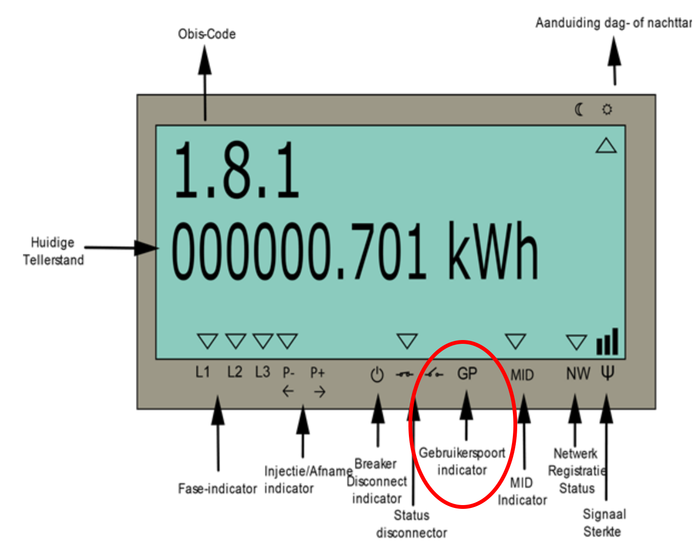
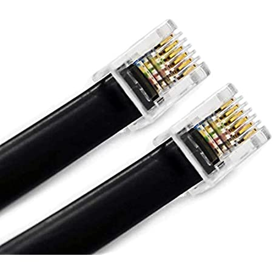
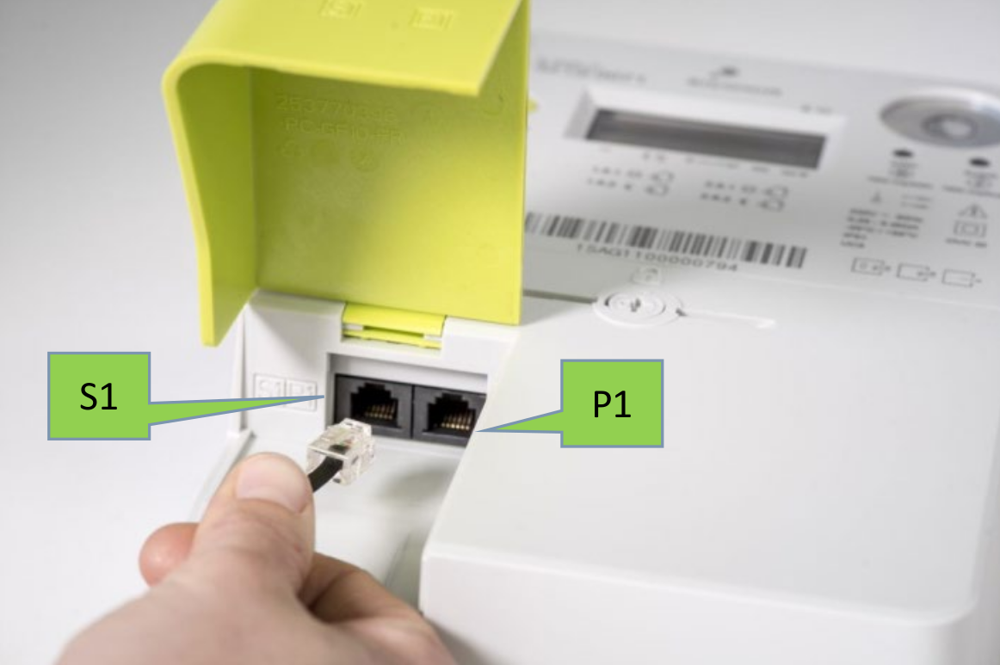

# Connecting your CDEM

Connecting the CDEM device to the utility meter is extremely easy. All you need is a 6-wired RJ12 cable. Plug one side in the meter and the other in the CDEM device. Once your digital meter user ports have been activated, the data of the meter can be retrieved with the CDEM device.

<!-- TODO - Image of a connected cdem device here -->

## Activating the Fluvius Meter Port

Before the data of the Fluvius digital meter can be read out, one has to activate the P1 port of the meter online (no technician is required). This can be achieved by requesting an online activation at the [Fluvius website](https://www.fluvius.be/nl/thema/meters-en-meterstanden/activeer-desactiveer-je-gebruikerspoorten).

You will need the following in order to make your request:

* your ID card
* a card reader or [itsme](https://www.itsme.be/) to login
* a recent energy invoice of your current supplier

After filling in the online form, the activation process can take up to several days. If your meter has just been placed, you should wait a couple of days before making this request to make sure that the meter is registered with Fluvius.

Once the activation process has been completed, your digital meter will start to send its telemetry data via the S1 and P1 ports. Do note that the meter itself does not send its data to the cloud or any other service. However, if ever required, the P1 port can be deactivated using the same online form.

::: tip ⌚ Can take some time
The actual meter activation process can take up to **72 hours**. Normally you should receive an email from Fluvius when the process is finished and the ports have become available.
:::

Once the user ports have been activated, it should be indicated by a small arrow above the `GP` on the digital meter. If not, than your user ports are not yet activated.

## Connecting to the Fluvius meter

Use the RJ12 cable to connect your Digital Energy Meter device to the Fluvius digital meter.

::: warning 📞 Straight Cable
Do make sure you have a straight cable and not a crossover cable. You can check this by holding both connectors next to each other in the same orientation and checking if the wire-coloring is the same on both sides.
:::

Connect to the **P1 port** of the digital meter (the right hand one when standing in front of the meter). **The S1 port will not work.**

Your CDEM device will immediately start booting as it draws it's power from the Fluvius digital meter. This is indicated by the power LED on the CDEM device lighting up blue.

[Device Operation](/07_operation) provides detailed information about the status LEDs and all the different states the device operates in.

## Mounting your CDEM

It's a good idea to protect the CDEM device from dust and accidental touching by enclosing it within a small case. Using some double sided tape, also allows you to attach the casing to the side of your Fluvius digital meter.

<!-- TODO - Full setup photo -->

<!-- TODO - Add casing here ? -->
