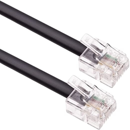

# Connecting to the Fluvius meter

## Activating the Fluvius Meter Port

Before the data of the Fluvius digital meter can be read out, one has to activate the P1 port of the meter online (no technician is required). This can be achieved by requesting an online activation at the [Fluvius website](https://www.fluvius.be/nl/thema/meters-en-meterstanden/activeer-desactiveer-je-gebruikerspoorten).

You will need the following in order to make your request:

* your ID card
* a cardreader or itsme to login
* a recent energy invoice of your current supplier

After filling in the online form, the activation process can take up to several days. If your meter has just been placed, you should wait a couple of days before making this request to make sure that the meter is registered with Fluvius.

Once the activation process has been completed, your digital meter will start to send its telemetry data via the S1 and P1 ports. Do note that the meter itself does not send its data to the cloud or any other service. However, if ever required, the P1 port can be deactivated using the same online form.

::: tip ⌚ Can take some time
The actual meter activation process can take up to **72 hours**. Normally you should receive an email from Fluvius when the process is finished and the ports have become available.
:::

## Connecting to the Fluvius meter

Use an RJ11 or RJ12 cable to connect your Digital Energy Meter device to the Fluvius digital meter. This is the same cable as used with the old telephone connections. Chances are you have one laying around if you have Proximus VDSL at home.

::: warning 📞 Straight
Do make sure you have a straight cable and not a crossover cable.
:::

Connect to the P1 port of the digital meter (the right one if standing in front of the meter). The S1 port will not work.

<!-- TODO - Draw arrow on P1 and cross on S1 -->

Now just power your Digital Energy Meter device with a USB power supply.

<!-- TODO - Photo of the whole setup -->
