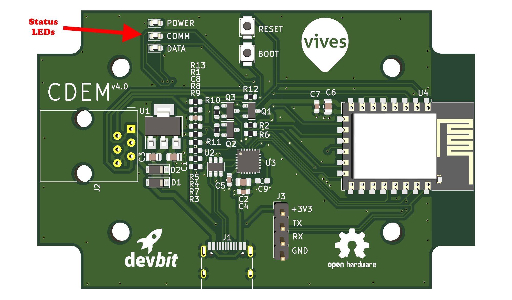
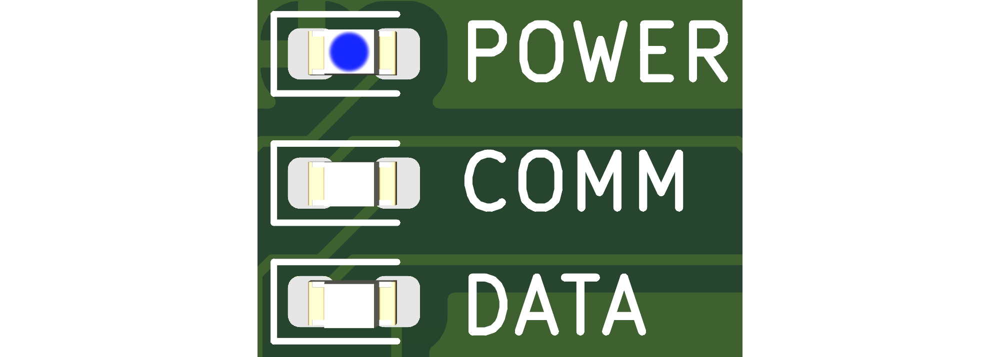
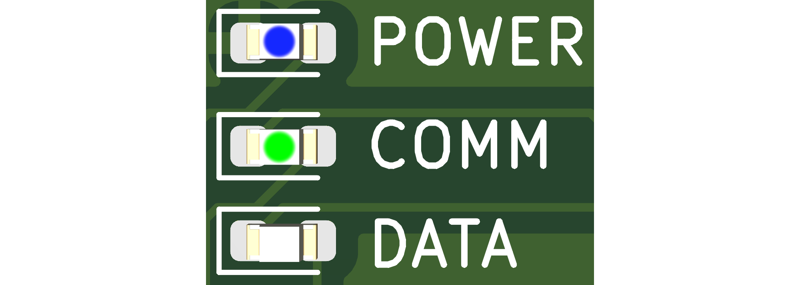
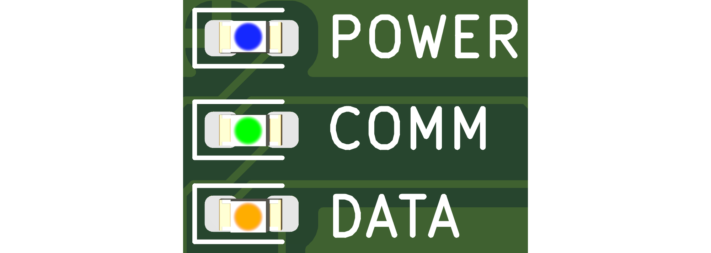
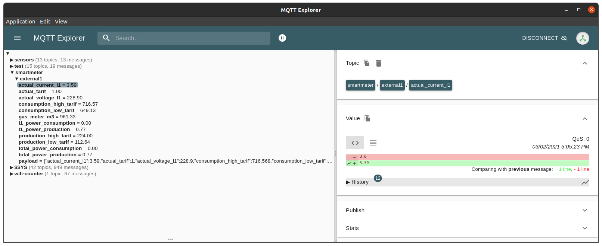

# Device Operation

The CDEM device is equipped with three status LEDs (power, comm and data) next to the RJ12 connector. These LEDs indicate what the device status is at all times and should provide the user with some basic feedback.

<!-- TODO - Update to v5 PCB -->



The following sections describe the different steps in the boot process and operational modes with their corresponding status LEDs.

## A Powered CDEM Device

Once your CDEM device is powered, the **power** LED will light up solid blue. This LED should be on during operation.

<!-- TODO: Change image to power led on  -->


::: danger 💡 Power Issue
If the power LED is on continuously when the device is plugged into the digital meter, there might be a power or the device might be faulty. Disconnect the device immediately and check the [Troubleshooting](/15_troubleshooting) section for more information.
:::

## The Boot Process

Immediately after applying power, the CDEM device will start the boot process.

Then the device will setup a configuration access point for about 5 minutes. This is indicated by the green communication LED blinking slowly (interval of about 2 seconds). You can either connect to the device and select the 'Boot without Saving' option from the configuration page or wait 5 minutes for the portal window to pass.


### Default Configuration

If the device has not been configured properly, it will not boot past the point of setting up the access point. This because your network information is required, before the datagrams can be published to an MQTT broker. This is also a preliminary safety measure to protect your data and make sure you as an owner of the device have taken the time to configure the device. This state will be indicated by the two LEDs (data and comm) blinking alternately (a police light as it were). Checkout the [Configuring your CDEM](/05_configuration) section for more information on how to configure the device properly.


## Communication Status

Once the device configuration has been validated, the device will continue the boot process by trying to connect to the WiFi network. As long as no WiFi connection could be established, the data LED will be off.


The moment an active WiFi connection can be established, the **data LED will flash quickly** while trying to **connect to the broker**.


If all goes well and the MQTT broker can be reached, the communication LED should turn solid green.



## Meter Readout Status

While setting up the WiFi connection and trying to connect to the broker, the CDEM device will continue the boot process and initialize the digital meter. This is indicated by the data LED blinking rapidly (interval of about 500 milliseconds).


Once a datagram has been successfully read from the digital meter, the data LED should turn solid orange.



If the data led keeps blinking orange and does not turn solid green after some time (depends on the readout interval you configured), then there please check the following:

* That the user ports of the Fluvius digital meter have been activated.
* That the cable is an RJ12 cable with 6 wires and is still ok. You may need to try out another cable.
* That the program jumper has been refitted in the correct position on your CDEM device.

<!-- TODO - Image here of the correct program jumper position -->

If neither of these help fixing the problem, please checkout the [Troubleshooting](/15_troubleshooting) section for more tips.

## Your Device at Work

If the device is fully operational and configured properly, then it will periodically:

* read a datagram from the P1 port of your Fluvius Digital Meter
* validate the received datagram
* decode the datagram to a human readable format
* publish that human readable format to your MQTT broker

In this case all three LEDs on the device should be lit continuously.


## Your Data

Once the data has been published to your MQTT broker, it will be available in the topic you configured (default `iot/myhome/cdem`). Each data parameter will be published on a sub-topic of this parent topic as a simple floating point or integral value:

| Sub-topic | Value Type | Description | Unit |
| :---:     | :---:      | :---:       | :---: |
| `consumption_high_tarif` | Floating Point | Cumulated electricity consumption (high tariff) | kWh |
| `consumption_low_tarif` | Floating Point | Cumulated electricity consumption (low tariff) | kWh |
| `production_high_tarif` | Floating Point | Cumulated electricity production (high tariff) | kWh |
| `production_low_tarif` | Floating Point | Cumulated electricity production (low tariff) | kWh |
| `total_power_consumption` | Floating Point | Instantaneous consumption over all phases | kW |
| `total_power_production` | Floating Point | Instantaneous production over all phases  | kW |
| `actual_voltage_l1` | Floating Point | Instantaneous voltage L1 | V |
| `actual_voltage_l2` | Floating Point | Instantaneous voltage L2 | V |
| `actual_voltage_l3` | Floating Point | Instantaneous voltage L3 | V |
| `actual_current_l1` | Floating Point | Instantaneous current L1 | A |
| `actual_current_l2` | Floating Point | Instantaneous current L2 | A |
| `actual_current_l3` | Floating Point | Instantaneous current L3 | A |
| `l1_power_production` | Floating Point | Instantaneous active power production L1 | kW |
| `l2_power_production` | Floating Point | Instantaneous active power production L2 | kW |
| `l3_power_production` | Floating Point | Instantaneous active power production L3 | kW |
| `l1_power_consumption` | Floating Point | Instantaneous active power consumption L1 | kW |
| `l2_power_consumption` | Floating Point | Instantaneous active power consumption L2 | kW |
| `l3_power_consumption` | Floating Point | Instantaneous active power consumption L3 | kW |
| `actual_tarif` | Integral | Tariff indicator (1=high, 2=low) | |
| `gas_meter_m3` | Floating Point | Total gas consumption | m^3 |

::: tip Different Readout
Do note that not all parameters may be available for your setup in your case. If you do not have a digital gas-meter, that information will not be available. You may also see only a single phase output if your home only uses a single phase.
:::

An all-in-one JSON representation will also be published in the subtopic `payload`. Below is an example of a real-life setup:

```json
{
   "actual_current_l1": 3.6,
   "actual_tarif": 1,
   "actual_voltage_l1": 227.3,
   "consumption_high_tarif": 716.568,
   "consumption_low_tarif": 649.135,
   "gas_meter_m3": 961.33,
   "l1_power_consumption": 0,
   "l1_power_production": 0.765,
   "production_high_tarif": 224.063,
   "production_low_tarif": 112.645,
   "total_power_consumption": 0,
   "total_power_production": 0.765
}
```

This allows for much easier processing using a custom application or for example NodeRED.

Using a tool such as [MQTT Explorer](http://mqtt-explorer.com/), you can easily take a look at it and check if the data is coming trough.



### Statistical Information

Next to the meter data, the device will also periodically send some statistical information in JSON format on the subtopic `stats`:

```json
{
  "decoded": 41887,
  "timeouts": 0,
  "published": 41887,
  "crcerrors": 0,
  "uptime": "4d 21h 58m 16s 70ms"
}
```

The following information is included in this payload:

* `decoded`: the number of successfully decoded datagrams.
* `timeouts`: the number of times the meter timed out while receiving data.
* `published`: the number of datagrams that have been scheduled for publishing.
* `crcerrors`: the number of crc error checks that have occurred when validating the datagrams.
* `uptime`: the time the device has been up and running.

### Device Details

When the device has booted successfully it will also send a one time device details message in JSON format on the subtopic `announce`:

```json
{
  "ip": "xxx.xxx.xxx.xxx",
  "mac": "XX:XX:XX:XX:XX:XX",
  "lib-version": "v1.1.0",
  "pcb-version": "v4.0",
}
```

The following information is included in this payload:

* `ip`: the local IP address of the device.
* `mac`: the MAC address of the WiFi interface of the device.
* `lib-version`: the version of the `connected-digital-energy-meter` library the firmware is using.
* `pcb-version`: the version of the PCB hardware used for your CDEM device.
