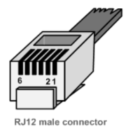
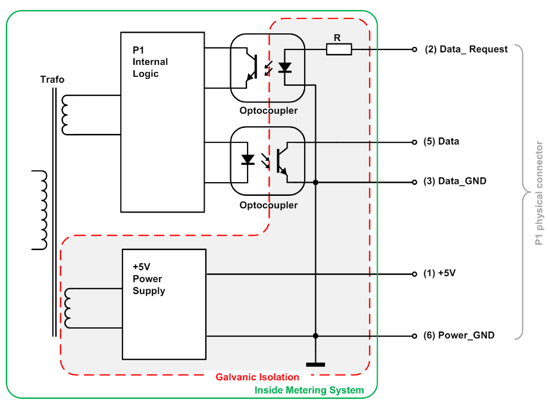

# Development information

## Communication with the P1 port of the Fluvius Smart Meter

All data communication with the Fluvius Smart Meter runs via the `P1 port`. The S1 port provides a limited posibility of data and therefore we won't be using this port.

The P1 port follows the [DSMR 5 standard](/files/dsmr5.pdf) of the Dutch Smart Meter extended with the [e-Mucs specification](/files/emucs.pdf).

### Physical connection

The P1 port is a serial interface that uses a standard RJ12 connector.

| Pin | Signal name         |
|-----|---------------------|
| 1   | + 5V (Power supply) |
| 2   | Data request        |
| 3   | Data GND (ground)   |
| 4   | Not connected       |
| 5   | Data                |
| 6   | GND (ground)        |

> **Safety**
>
> In order to protect both the user and the Fluvius Smart Meter the P1 port is galvanically isolated from the mains.
>
> 

#### +5V Power supply

The P1 interface provides a stable +5V DC power supply via "+5V" (pin 1) and "GND"(pin 6) lines to provide a connected IoT device with a power source.

U = 5,0 V ( max = 5,5 V with I = 0 mA , min = 4,9 V with I = 250 mA )

#### Data request

The P1 port is activated (will start sending data) by setting "Data request" (pin 2) high (4,0V to 5,5V). While recieving data, this line must be kept high.

::: warning Warning
To stop receiving data the "Data request" line must be put in a high impedance mode and must not be connected to the GND or 0V
:::

#### Data

Here we run into our first problem. Due to the use of optocouplers, the "Data" (pin 5) line must be designed as an **Open Collector** output and must be **logically inverted** before it can be used with IoT device ( Raspberri Pi, ESP32, Arduino, ...).

A "Data" line LOW has a voltage of 0,2 V (0 - 1V), HIGH has a voltage of 5,0V with a maximum current of 30 mA.

The solution is either to use a pre-made cable like for instance [this one](https://www.sossolutions.nl/slimme-meter-kabel), or to provide the signal inversion yourself.

### Communication protocol

Here we run into our second problem. The P1 communication protocol of a Fluvius Smart Meter is based on the DSMR 5 standard used in the Netherlands but extended with the e-Mucs specifications. Therefore all solutions found on the internet for the Netherlands are not applicable for the Fluvius Smart Meter.

#### Transfert speed and character formatting

The interface must use a fixed transfer speed of 115200 baud. 

:: tip Note
Due to the 115200 baud-rate the max. cable length for this serial communication is 2,5 m.
:::

The Fluvius Smart Meter sends its data to the connected IoT device every single second and the transmission of the entire P1 telegram is completed within 1s.

The format of transmitted data is defined as “8N1”. Namely:
- 1 start bit,
- 8 data bits,
- no parity bit and
- 1 stop bit.

#### Data readout

The Fluvius Smart Meter transmits the data message, as described below, immediately following the activation through the Request signal.

#### End of transmission

The data transmission is complete after the data message has been transmitted. An acknowledgement signal is not provided for.

#### Data objects

For more information on the OBIS codes see the [DSMR 5 standard](/files/dsmr5.pdf) and [e-Mucs specification](/files/emucs.pdf).

##### Electricity data

| OBIS reference | Value | Example |
|---|---|---|
| 0-0:96.1.1.255 | Equipment identifier | 0-0:96.1.1(4B384547303034303436333935353037) |
| 1-0:1.8.1.255 | Meter Reading electricity delivered to client (normal tariff) in 0,001 kWh | 1-0:1.8.1(123456.789*kWh) |
| 1-0:1.8.2.255 | Meter Reading electricity delivered to client (low tariff) in 0,001 kWh | 1-0:1.8.2(123456.789*kWh) |
| 1-0:2.8.1.255 | Meter Reading electricity delivered by client (normal tariff) in 0,001 kWh | 1-0:2.8.1(123456.789*kWh) |
| 1-0:2.8.2.255 | Meter Reading electricity delivered by client (low tariff) in 0,001 kWh | 1-0:2.8.2(123456.789*kWh) |
| 0-0:96.14.0.255 | Tariff indicator electricity. (1=normal, 2=low) The tariff indicator can be used to switch tariff dependent loads e.g boilers. This is responsibility of the P1 user | 0-0:96.14.0(0002) |
| 1-0:1.7.0.255 | Actual electricity power delivered (+P) in 1 Watt resolution | 1-0:1.7.0(01.193*kW) |
| 1-0:2.7.0.255 | Actual electricity power received (-P) in 1 Watt resolution | 1-0:2.7.0(00.000*kW) |
| 0-0:96.7.21.255 | Number of power failures in any phases | 0-0:96.7.21(00004) |
| 0-0:96.7. 9.255 | Number of long power failures in any phases | 0-0:96.7.9(00002) |
| 1-0:99:97.0.255 | Power failure event log | 1-0:99.97.0(2)(0-0:96.7.19)(101208152415W)(0000000240*s)(101208151004W)(0000000301*s) |
| 1-0:32.32.0.255 | Number of voltage sags in phase L1 | 1-0:32.32.0(00002) |
| 1-0:52.32.0.255 | Number of voltage sags in phase L2 | 1-0:52.32.0(00001) |
| 1-0:72.32.0.255 | Number of voltage sags in phase L3 | 1-0:72.32.0(00000) |
| 1-0:32.36.0.255 | Number of voltage swells in phase L1 | 1-0:32.36.0(00000) |
| 1-0:52.36.0.255 | Number of voltage swells in phase L2 | 1-0:52.36.0(00003) |
| 1-0:72.36.0.255 | Number of voltage swells in phase L3 | 1-0:72.36.0(00000) |
| 1-0:32.7.0.255 | Instantaneous voltage L1 | 1-0:32.7.0(220.1*V) |
| 1-0:52.7.0.255 | Instantaneous voltage L2 | 1-0:52.7.0(220.2*V) |
| 1-0:72.7.0.255 | Instantaneous voltage L3 | 1-0:72.7.0(220.3*V) |
| 1-0:31.7.0.255 | Instantaneous current L1 | 1-0:31.7.0(001*A) |
| 1-0:51.7.0.255 | Instantaneous current L2 | 1-0:51.7.0(002*A) |
| 1-0:71.7.0.255 | Instantaneous current L3 | 1-0:71.7.0(003*A) |
| 1-0:21.7.0.255 | Instantaneous active power L1 (+P) | 1-0:21.7.0(01.111*kW) |
| 1-0:41.7.0.255 | Instantaneous active power L2 (+P) | 1-0:41.7.0(02.222*kW) |
| 1-0:61.7.0.255 | Instantaneous active power L3 (+P) | 1-0:61.7.0(03.333*kW) |
| 1-0:22.7.0.255 | Instantaneous active power L1 (-P) | 1-0:22.7.0(04.444*kW) |
| 1-0:42.7.0.255 | Instantaneous active power L2 (-P) | 1-0:42.7.0(05.555*kW) |
| 1-0:62.7.0.255 | Instantaneous active power L3 (-P) | 1-0:62.7.0(06.666*kW) |
| 0-0:96.3.10.255 | Breaker state | 0-0:96.3.10(1) |
| 0-0:17.0.0.255 | Limiter treshold | 0-0:17.0.0(123.4*kW) |
| 1-0:31.4.0.255 | Fuse supervision threshold (L1) | 1-0:31.4.0(001*A) |

::: warning Warning
The Obis-references for High and Low tarif are switch for the Belgian meter compared to the Dutch meter!
:::

##### Messages

| OBIS reference | Value | Example |
|---|---|---|
| 0-0:96.1.4.255 | Version information | 0-0:96.1.4(50) |
| 0-0:96.13.0.255 | Text message max 1024 characters. | 0:96.13.0(303132333435363738393A3B3C3D3E3F303132333435363738393A3B3C3D3E3F303132333435363738393A3B3C3D3E3F303132333435363738393A3B3C3D3E3F303132333435363738393A3B3C3D3E3F) |
| 0-0:96.13.1.255 | Consumer message code | 0-0:96.13.1(3031203631203831) |

##### Gas data

| OBIS reference | Value | Example |
|---|---|---|
| 0-n:24.1.0.255 | Device-Type | 0-1:24.1.0(003) |
| 0-n:96.1.0.255 | Equipment identifier | 0-1:96.1.0(3232323241424344313233343536373839) |
| 0-n:24.2.1.255 | Last 5-minute value (temperature converted), gas delivered to client in m3, including decimal values and capture time | 0-1:24.2.1(101209112500W)(12785.123*m3) |
| 0-n:96.1.1.255 | M-Bus Device ID 2 |  0-1:96.1.1(3232323241424344313233343536373839) |
| 0-n:24.4.0.255 | Valve state | 0-1:24.4.0(1) |
| 0-n:24.2.3.255 | Last value of ‘not temperature corrected’ gas volume in m³, including decimal values and capture time | 0-1:24.2.3(101209112500W)(12785.123*m3) | 

##### Thermal data

| OBIS reference | Value | Example |
|---|---|---|
| 0-n:24.1.0.255 | Device-Type | 0-1:24.1.0(003) |
| 0-n:96.1.0.255 | Equipment identifier | 0-1:96.1.0(3232323241424344313233343536373839) |
|  0-n:24.2.1.255 | Last 5-minute Meter reading Heat or Cold in 0,01 GJ and capture time | 0-1:24.2.1(12.34*GJ) |

##### Water data

| OBIS reference | Value | Example |
|---|---|---|
| 0-n:24.1.0.255 | Device-Type | 0-1:24.1.0(003) |
| 0-n:96.1.0.255 | Equipment identifier | 0-1:96.1.0(3232323241424344313233343536373839) |
| 0-n:24.2.1.255 | Last 5-minute Meter reading in 0,001m3 and capture time | 0-1:24.2.1(12785.123*m3) |

::: warning Warning
Be aware of the fact that the number of OBIS codes and the order of them is not fixed. Therefore the connected IoT device must be able to interpret the P1 telegram.
:::

## Development of the hardware

* hoe zit de pcb in elkaar + link naar files

## Development of the firmware

* hoe zit de firmware in elkaar ( flowchart )

