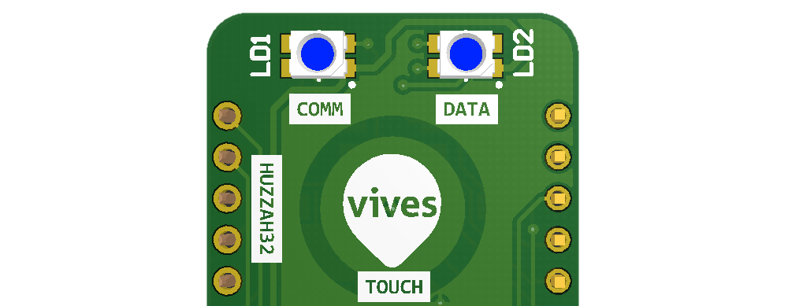
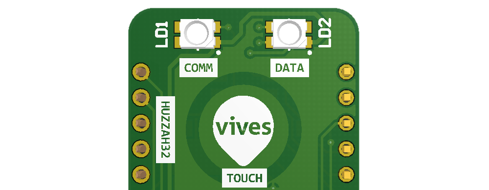
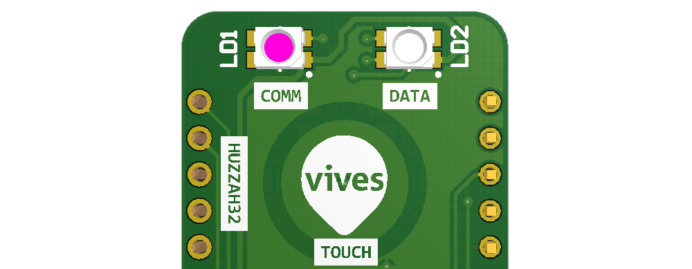
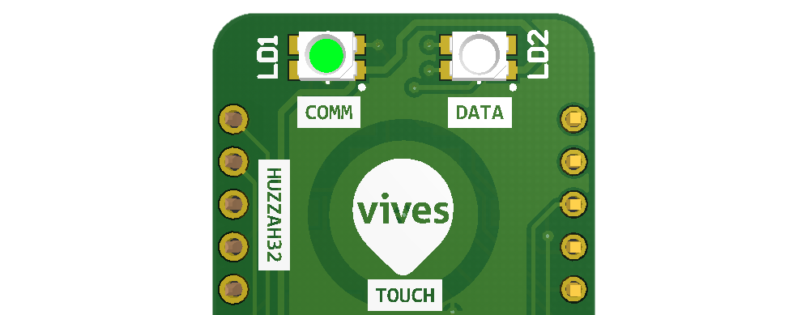
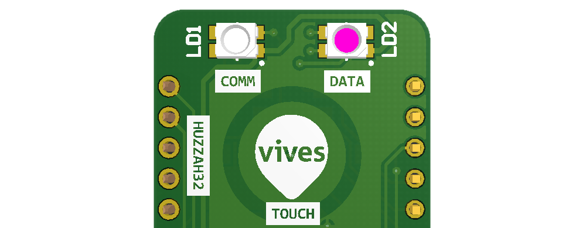
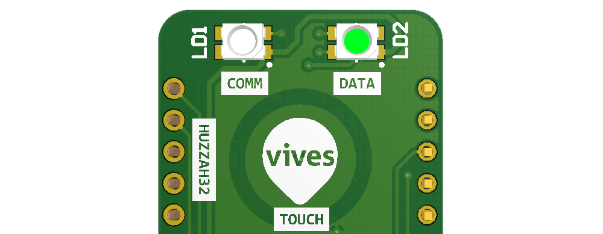

# Device Operation

The CDEM device is equipped with two RGB status LEDs on the opposite side of the RJ11 connector. The left is the communication LED and the right one is the data LED. These LEDs indicate what the device status is at all times and should provide the user some basic feedback.


## Booting

Once your CDEM device is powered it will start **booting**. This is indicated by both status LEDs blinking blue with a delay of 1 second.



If the touch pad is held while booting, the device will enter the **boot menu** and both LEDs will blink blue with a delay of 1 second, but in an alternating pattern.


::: tip Separate LEDs
Only while booting should you take both LEDs into account at the same time to determine the current status. All the steps in the boot-process are depicted using the blue LEDs.

Once the boot process is finished, the LEDs should be considered separately. The left one depicting the communication state and the right one the data state.
:::

### The Communication LED

The communication LED (left one) depicts the current state of all communication to the outside. This includes both the MQTT broker connection as well as the WiFi status.

Basically there are three states that the communication LED will display.

#### No Communication

In case there is no active WiFi connection and therefore also no MQTT broker connection, the communication LED will blink red rapidly.



This should not be a problem right after booting as it will take a few seconds to setup the WiFi connection. If this status does change, then the connection to the WiFi network fails. This can either be problem with range or a bad SSID or Password.

If it happens after some time, it may be that the device is requesting a new IP address from your router or that the connection was momentarily lost. If this does not happen too often and quickly restores, it should not be a problem.

#### WiFI Up but no MQTT Connection

Once the WiFi has come up, the communication led will turn purple/magenta. This indicates that the connection is being setup with the MQTT broker. This process can take a few second.



If the state does not change after a few seconds, there is problem connecting to the MQTT broker. This can be caused by a mis-configured broker. Double check the IP address of the broker.

Also make sure that the broker is available from the WiFi network the CDEM device is connected to. A quick check can be to connect to the same network using a laptop and pinging the broker via it's IP address.

#### Communication Up

If all went well and both WiFi and MQTT are up and running, the communication LED should turn lime green.



### The Data LED

The data LED (right one) depicts the current state of the connection with the digital meter. This includes both be able to read the datagrams as well as decode them.

Basically there are three states that the data LED will display.

#### Starting Meter

When the device finished booting and the WiFi was initialized (does not have to be connected), the CDEM device will request data from the digital meter. In this initial state the data led will turn purple/magenta, indicating that the meter readout is starting.



After a few seconds the data led will indicate if the data readout was successful or erroneous.

#### Data Readout Successful

If the data was read successfully from the meter and validated, then the data LED will turn lime green, indicating an all is good status.



#### Meter Connection Error

In case the data read-out from the digital meter fails, the data LED will blink red rapidly.


If it happens once in a while, it means that the connection to the meter is not optimal and the meter sometimes fails to answer the data request in the given time window or that the data validation failed. This can happen if the wire signal is not ideal and interference is being picked up from another source. It can help to use a shorter cable and placing the device closer to the meter.

When this happens after connecting the CDEM device to the meter for the first time or if the LED does not turn back green after a couple of minutes (depending on the read-out time you configured), there is probable another cause.

This can be a wiring/connection problem. Make sure that the cable you are using is ok. Also try not to use a cable that is longer than a few meters. The signal may degenerate too much if the cable is too long.

It could also be that the meter is not yet activated for outputting its data via the P1 port. Make sure you activated the meter online - see [Activating the Fluvius Meter Port](./07_connect/#activating-the-fluvius-meter-port). Make sure you received an email or SMS from Fluvius indicating that the meter has been activated.

Also make sure that the shield has been soldered correctly and no short-circuits have been made or components have been forgotten. Double check that you did not flip the 74HCT14 inverter IC.

## Your device at work

Once your device has WiFi connection and is connected to your MQTT broker it will periodically:

* read a datagram from the P1 port of your Fluvius Digital Meter
* validate the received datagram
* decode the datagram to a human readable format
* publish that human readable format to your MQTT broker

## Your Data

Once the data has been published to your MQTT broker, it will be available in the topic you configured (default `iot/myhome/cdem`). Each data parameter will be published on a sub-topic of this parent topic as a simple floating point or integral value:

| Sub-topic | Value Type | Description | Unit |
| :---:     | :---:      | :---:       | :---: |
| `consumption_high_tarif` | Floating Point | Cumulated electricity consumption (high tariff) | kWh |
| `consumption_low_tarif` | Floating Point | Cumulated electricity consumption (low tariff) | kWh |
| `production_high_tarif` | Floating Point | Cumulated electricity production (high tariff) | kWh |
| `production_low_tarif` | Floating Point | Cumulated electricity production (low tariff) | kWh |
| `total_power_consumption` | Floating Point | Instantaneous consumption over all phases | kW |
| `total_power_production` | Floating Point | Instantaneous production over all phases  | kW |
| `actual_voltage_l1` | Floating Point | Instantaneous voltage L1 | V |
| `actual_voltage_l2` | Floating Point | Instantaneous voltage L2 | V |
| `actual_voltage_l3` | Floating Point | Instantaneous voltage L3 | V |
| `actual_current_l1` | Floating Point | Instantaneous current L1 | A |
| `actual_current_l2` | Floating Point | Instantaneous current L2 | A |
| `actual_current_l3` | Floating Point | Instantaneous current L3 | A |
| `l1_power_production` | Floating Point | Instantaneous active power production L1 | kW |
| `l2_power_production` | Floating Point | Instantaneous active power production L2 | kW |
| `l3_power_production` | Floating Point | Instantaneous active power production L3 | kW |
| `l1_power_consumption` | Floating Point | Instantaneous active power consumption L1 | kW |
| `l2_power_consumption` | Floating Point | Instantaneous active power consumption L2 | kW |
| `l3_power_consumption` | Floating Point | Instantaneous active power consumption L3 | kW |
| `actual_tarif` | Integral | Tariff indicator (1=high, 2=low) | |
| `gas_meter_m3` | Floating Point | Total gas consumption | m^3 |

::: tip Different Readout
Do note that not all parameters may be available for your setup in your case. If you do not have a digital gas-meter, that information will not be available. You may also see only a single phase output if your home only uses a single phase.
:::

An all-in-one JSON representation will also be published in the subtopic `payload`. Below is an example of a real-life setup:

```json
{
   "actual_current_l1": 3.6,
   "actual_tarif": 1,
   "actual_voltage_l1": 227.3,
   "consumption_high_tarif": 716.568,
   "consumption_low_tarif": 649.135,
   "gas_meter_m3": 961.33,
   "l1_power_consumption": 0,
   "l1_power_production": 0.765,
   "production_high_tarif": 224.063,
   "production_low_tarif": 112.645,
   "total_power_consumption": 0,
   "total_power_production": 0.765
}
```

This allows for much easier processing using a custom application or for example NodeRED.

Using a tool such as [MQTT Explorer](http://mqtt-explorer.com/), you can easily take a look at it and check if the data is coming trough.


## Resetting your device

In the unfortunate case the firmware of your CDEM device crashes or gets stuck, you can always safely reset your device by pressing the small reset button just above the RJ11 connector.

Place a thin but not sharp pin into the hole just beneath the VIVES logo and press gently.

Your device will then reboot.

Of course you can also interrupt the USB power supply to do this.

<!-- ## In Case of Serious Problems -->

<!-- Attach to computer and use Arduino IDE -->
