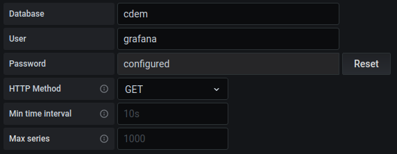

# Building a Dashboard

Once your meter data reaches the MQTT broker it can basically be coupled to anything. Think [Home Assistant](https://www.home-assistant.io/), [Node-RED](https://nodered.org/), [Grafana](https://grafana.com/), ... and if you know you way around any programming languages, changes are there is an MQTT library available.


In this chapter we'll describe the process of setting up a Grafana dashboard. No programming knowledge is required, it just takes some basic configuration and you'll see your telemetry flash by in no time.

Because this setup should be running at all times, you will need a device to host the services we'll be setting up. This can be a PC, NAS or for example a Raspberry Pi. The services we will be setting up include [InfluxDB](https://www.influxdata.com/), [Node-RED](https://nodered.org/) and [Grafana](https://grafana.com/).

If you are looking for a [Home Assistant](https://www.home-assistant.io/) setup, then please checkout the [Home Assistant](/10_home_assistant) chapter.

## Overview

For demonstrational purposes we'll provide a setup example on how to build a permanently available Grafana dashboard hosted on a Raspberry Pi device. Since the setup will not be needing a lot of processing power, the Raspberry Pi is actually perfect for this.

::: warning Raspberry Pi 4
This setup has only been tested with a Raspberry Pi 4 with 4GBs of memory. While it may work on an older Raspberry Pi, or a Raspberry Pi 4 with less memory, this has not been tested by us.
:::

<!-- TODO - Maybe we should also test it with a Raspberry Pi 3 -->

In order to setup a nice Grafana dashboard, we will need some additional services. An overview of all the services is shown in the next diagram.


Basically, when the meter data reaches the **MQTT broker**, its no more than data from a given point in time. To create historical graphs we need some sort of storage. This is where **InfluxDB** comes in. Its a light-weight and proven time-series database. Ideally for storing our timestamped data.

Mosquitto (the MQTT broker) however, does not know how to talk to InfluxDB. This is the job of **Node-RED**, which acts as a connector from MQTT to InfluxDB. All data published to the MQTT broker is received by a Node-RED flow that does some minimal processing and then sends it to the InfluxDB.

Once this is setup, the data is safely stored inside the InfluxDB and its time to make the data visually available. This is where **Grafana** comes into play. Grafana is an analytics and interactive visualization web application. Basically, a dynamic and highly configurable dashboard generator.

All these tools are open source and can be used freely of charge.

If you are familiar with Linux / Docker and have a NAS or server running at home, you can actually skip the rest of this chapter and just use docker and docker compose to get a full working setup. Just checkout the [Docker Compose](/11_docker_compose) chapter.

## Updating your System

First make sure everything is up to date. This could take a while, especially on a new Raspberry Pi:

```bash
sudo apt update
sudo apt upgrade -y
```

## Installing Node-RED

The installation instructions for Node-RED on a Raspberry Pi can be found on the website of [Node-RED](https://nodered.org/docs/getting-started/). Just pick the *Raspberry Pi* tutorial and follow it carefully. Make sure Node-RED is working before continuing.

::: tip Node-RED Tutorials
If this is your first interaction with Node-RED, feel free to play around a bit. There are some great [tutorials](https://nodered.org/docs/tutorials/) available on their website. YouTube also has some nice videos on the subject. 
:::

## Installing InfluxDB

To be able to install InfluxDB on the Raspberry Pi, we will first need to add the repository key to APT. Adding the key will allow the package manager on Raspbian to search the repository and verify the packages its installing.


```bash
wget -qO- https://repos.influxdata.com/influxdb.key | sudo apt-key add -
```

Now that the InfluxDB repository key has been installed to the Raspberry Pi, we will need to go ahead and add its repository to the sources list.

```bash
source /etc/os-release
echo "deb https://repos.influxdata.com/debian $(lsb_release -cs) stable" | sudo tee /etc/apt/sources.list.d/influxdb.list
```

With the repository added, we now need to go ahead and update the package list again. This has to be done so that the APT package manager also searches the repository that we just added for packages.

```bash
sudo apt update
```

Now your system is ready to install InfluxDB:

```bash
sudo apt install -y influxdb
```

Once finished, start the InfluxDB service and also make sure that it starts when the Raspberry Pi boots:

```bash
sudo systemctl unmask influxdb.service
sudo systemctl start influxdb
sudo systemctl enable influxdb.service
```

### Creating a Database

You should now be able to run the `influx` client and create a new database called `home`. Since our InfluxDB instance will only be accessible locally, we create a single admin user called `grafana`.

First start the InfluxDB client:

```bash
influx
```

You are now presented with a terminal that will accept valid influx commands.

::: output
<pre>
Connected to http://localhost:8086 version 1.8.4
InfluxDB shell version: 1.8.4
> 
</pre>
:::

Start by creating a database using the following commands:

```
create database cdem
use cdem
```

::: output
<pre>
Using database cdem
</pre>
:::

Next create a `grafana` user with a strong password.

```
create user grafana with password 'strong_password_here' with all privileges
grant all privileges on cdem to grafana
```

You can always double check if all went well by using the commands `show users` and `show databases`.

Type `exit` to leave the influx client.

### Installing Grafana

As was required with InfluxDB, for Grafana we also need to add the APT key so the packages can be authenticated:

```bash
wget -q -O - https://packages.grafana.com/gpg.key | sudo apt-key add -
```

Add the Grafana APT repository:

```bash
echo "deb https://packages.grafana.com/oss/deb stable main" | sudo tee -a /etc/apt/sources.list.d/grafana.list
```

Now you are ready install Grafana:

```bash
sudo apt-get update
sudo apt-get install -y grafana
```

Grafana is now installed, but not yet running. To make sure Grafana starts up even if the Raspberry Pi is restarted, we need to enable and start the Grafana Systemctl service. Proceed by enabling and starting the Grafana server:

```bash
sudo systemctl unmask grafana-server.service
sudo systemctl enable grafana-server
sudo systemctl start grafana-server.service
```

Grafana is now running on the machine and is accessible from any device on the local network.

Open a browser and go to `http://<raspberry_ip_address>:3000`, where the IP address is the address that you used to connect to the Raspberry Pi earlier. You’re greeted with the Grafana login page.

Log in to Grafana with the default username `admin`, and the default password `admin`. **Change the password** for the `admin` user when asked.


Congratulations! Grafana is now running on your Raspberry Pi. If the Raspberry Pi is ever restarted or turned off, Grafana will start up whenever the machine regains power.

## Adding InfluxDB to Grafana

With InfluxDB and Grafana running, we can stitch them together. Log in to your Grafana instance and navigate to `Data Sources` by clicking the configuration gear icon ⚙️ on the left. Hit the `Add data source` button and look for the `InfluxDB` data source below `Time series Databases`.

Use `CDEM` as the name of the data source.

As we are running both services on the same device, set the URL to `http://localhost:8086`, where `8086` is the default port InfluxDB is running on.


Now scroll down and set the database to `cdem`, the user to `grafana` and also fill in the password that you used for the `grafana` user with InfluxDB.



That’s all that is required.

Now go ahead and hit `Save & Test` to allow Grafana to test the connection to the database and if successful save it.


## Node-RED Flow

The next step is to setup a Node-RED flow that will subscribe to our MQTT topic on which the meter is being published, process the data a bit and store it in the InfluxDB.

Start by opening another browser tab/window and navigating to `http://<raspberry_ip_address>:1880`, where `1880` is the default port on which Node-RED is exposed.


Before we can continue, we'll need to install the `node-red-contrib-influxdb` module to allow Node-RED to communicate with InfluxDB. Click the hamburger menu icon in the top right corner and navigate to `Manage palette`. Select the `Install` tab and search for `influxdb`


Select the `node-red-contrib-influxdb` module and click the `Install` button on the right. Select `Install` when a popup appears. If all went well, the module should be tagged as `Installed`.

Next [download](/files/cdem_node_red.json) our Node-RED flow. This flow will subscribe to the topic that contains the data of your Connected Digital Energy Meter from the MQTT broker and push it to your InfluxDB.

Import the flow into Node-RED by clicking the hamburger menu in the top right and selecting `Import`. Click the button `select a file to import` and select the `cdem_node_red.json` file you just downloaded. Once loaded, click the `Import` button.

You should now have a new flow tab on top called `CDEM`. Click to tab to show the flow.


If you changed the factory default MQTT topic when you configured the CDEM device, you will need to reflect this change in this flow. Double click the `MQTT Payload topic` node in the flow and configure the correct `Topic`. **Do make sure to leave the `/payload` topic intact at the end.**

You may also need to change your broker settings when your MQTT broker is not running on the Raspberry Pi itself. You can configure your broker by clicking the pencil icon next to the `Server` setting. Click `Done` when finished.


::: warning InfluxDB Database
In case you did not use the same database name for InfluxDB as we did, `cdem`, you will also need to configure the InfluxDB server to make use of the correct database. Double click any of the InfluxDB nodes on the right and hit the pencil icon next to the `Server` setting. You can now change the `Database` name. Hit `Update` and `Done` when finished.
:::

Once you are ready, hit the big red `Deploy` button in the top right corner.

You can check the data coming in by clicking the small bug icon in the top right. That will open up the debug panel and print out the debug message.


::: danger 🔥 Error - Unable to parse ...
If you get the error message `Error: A 400 Bad Request error occurred: {"error":"unable to parse 'water_meter_m3 value=undefined': invalid boolean"}` it means you have no digital water meter connected to the digital electricity meter. You can fix this by disabling the `Water Meter` influx node on the bottom right of the flow. Double click it, click the `Enabled` button in the bottom left and click `Done`. Update the running flow by clicking `Deploy` again.
:::

## Grafana Dashboard

Now is the time we all have been waiting for. A visual representation of the Connected Digital Energy Meter data.

Start by [downloading the template dashboard](/files/grafana_dashboard.json) we build for Grafana.

Now open Grafana in your browser and navigate to the four squares `Dashboards` icon on the left and select `Manage`. Select the `Import` button in the top right,

Next click the `Upload JSON file` button and select the template dashboard file you just downloaded.


You can probable leave the options as is. Click `Import` to finish the import.


## Interpreting the Dashboard

* In the electricity graphs you can detect spikes in delivery and start investigating the cause. The next step is to check if you can either make improvements or redirect this energy usage to a low tarif period.


* You can also evaluate your consumption in low and normal tarif to make decisions about when to use the large energy consuming appliances.

* If you have a form of domotics you could use the tarif indicator to shut down some of your appliances (freezer, boiler, ...) while in normal tarif. You can do this by adding some automation with Node-RED.

## Future

Once all the MQTT data from your Connected Digital Energy Meter is redirected to your InfluxDB you can add extra's like:

* Power info from your Solar Panel Inverter
* Outdoor and indoor temperature
* Your central heating system
