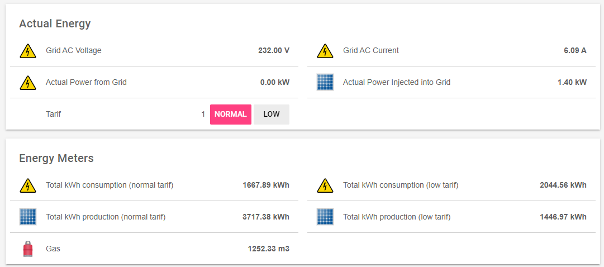

# openHAB

<!-- TOTO: Test if this info is correct and complete to setup openHab CDEM info page -->

[openHAB](https://www.openhab.org/) is a open source home automation platform.

In this chapter we will be discribing how to import the MQTT data from your CDEM for displaying and automation purposes.

* First you will want to install a MQTT binding.

* Next you will want to add the MQTT broker to things. This will form a bridge to your MQTT broker.

* Next you will want to add the MQTT binding to things. Use the MQTT broker you previously defined as bridge.

* Next you will want to add the channels (these are the topics of your broker) to that MQTT binding. Select the previous made MQTT binding and go to the tab 'channels'. Now Add a channel for each value you want to use in openHAB. 

* Once a channel has been added you will need to link a item to it. Just select the channel and click 'Add link to Item'. Next click 'Item to Link' and select the correct item.

* Next you will be able to add the information to a existing or new [page](https://www.openhab.org/docs/ui/sitemaps.html).

The result could look like this:

Of course is visualisation of the energy value's only the first step in energy effeciency.
The next step will be to use that data to make your home energy consumption better.
See chapter [Energy Efficiency](/12_energysavings) for more information on that.