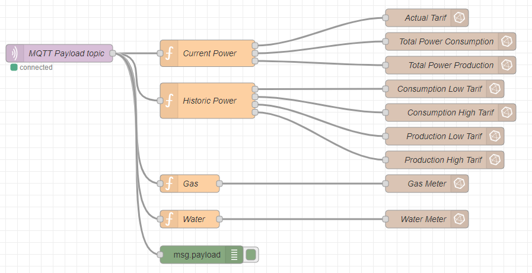

# Using the output


The firmware publishes your data to a MQTT broker. In order to use it, you still need to integrate that information into your dashboard or demotics system.
We have provided you with a example of how to do that with the help of Node-Red, InfluxDB and Grafana.

Because this information must be available at all times you need a installation device that is running constantly. This can be a PC, NAS or in our case a Raspberry Pi.

## Example with Node-red, InfluxDB and Grafana

In order to quickly establish a dashboard with free to use software we have build the following integration:

* Node-red to retrieve MQTT data and publish it to a timebased database
* InfluxDB to get all published MQTT data into a timebased database
* Grafana to build a nice dashboard

### Getting up to date

First off we’ll make sure everything is up to date. This could take a while, especially on a new Pi:

```bash
sudo apt update
sudo apt upgrade -y
```
### Installing Node-red


See [these](https://nodered.org/docs/getting-started/raspberrypi) installation instructions.

::: warning Note
If you are not, please get familiar with the usage of Node-Red before continuing.
:::

### Installing InfluxDB


First we add Influx repositories to apt:

```bash
wget -qO- https://repos.influxdata.com/influxdb.key | sudo apt-key add -
source /etc/os-release
echo "deb https://repos.influxdata.com/debian $(lsb_release -cs) stable" | sudo tee /etc/apt/sources.list.d/influxdb.list
```

Update apt with the new repos, & install.

```bash
sudo apt update && sudo apt install -y influxdb
```

Then start the influxdb service and set it to run at boot:

```bash
sudo systemctl unmask influxdb.service
sudo systemctl start influxdb
sudo systemctl enable influxdb.service
```

We should now be able to run the influx client with influx and create a user for later (here we use a single admin user grafana for simplicity):

```bash
create database home
use home

create user grafana with password '<passwordhere>' with all privileges
grant all privileges on home to grafana

show users

user admin
---- -----
grafana true
```

::: warning Note
If you are not, please get familiar with the usage of InfluxDB before continuing.
:::

### Installing Grafana


Again we need to add the Grafana packages to apt:

```bash
wget -q -O - https://packages.grafana.com/gpg.key | sudo apt-key add -
echo "deb https://packages.grafana.com/oss/deb stable main" | sudo tee /etc/apt/sources.list.d/grafana.list
```
We can now update and install the binaries:

```bash
sudo apt update && sudo apt install -y grafana
```
Then simply enable the service and set to run at boot:

```bash
sudo systemctl unmask grafana-server.service
sudo systemctl start grafana-server
sudo systemctl enable grafana-server.service
```

Now we can check that grafana is up by loading it in a browser: `http://<ipaddress>:3000`. If so, you can log in with the username and password = admin and set a new admin password.

### Add InfluxDB as a Grafana data source

Now we have both Influx and Grafana running, we can stitch them together. Log in to your Grafana instance and head to “Data Sources”. Select “Add new Data Source” and find InfluxDB under “Timeseries Databases”.

As we are running both services on the same Pi, set the URL to localhost and use the default influx port of 8086:


We then need to add the database, user and password that we set earlier:


That’s all we need! Now go ahead and hit “Save & Test” to connect everything together:


### Use Node-red to retrieve published MQTT data and add it to InfluxDB

Now we use Node-red to retrieve published data of your Connected Digital Energy Meter from the MQTT broker and publish it to your InfluxDB.



You can download this flow [here](/files/cdem.json).

Before deploying you still need to correct your `base topic` of the MQTT broker and the `IP adress` of the broker.

In order to use the `influxdb out` node you will have to install `node-red-contrib-influxdb`.

Once all the MQTT data from your Connected Digital Energy Meter is redirected to your InfluxDB you can add extra's like:
- Power info from your Solar Panel Inverter
- Outdoor and indoor temperature
- Your central heating system

### Use Grafana to build a dashboard with the data in your InfluxDB

Finaly we use Grafana to build a dashboard with the information from your Connected Digital Energy Meter.

You can download a sample dashboard [here](/files/grafana.json).


<!-- TODO: Change this image once we have actual data  -->

### Interpret your dashboard

* In the electricity graphs you can detect spikes in delivery and start investegating the cause and if you can either make improvements or redirect this energy usage to a low tarif period.


* You can also evaluate your consumption in low and normal tarif to make decisions about when to use the large energy consuming appliences.

* If you have a form of dometics you could use the tarif indicator to shut down some of your appliences (freezer, boiler, ...) while in normal tarif. You can do this by adding some automation with Node-red.

## Example with Homeassistant

Comming soon...

<!-- TODO: Home assitant example -->
