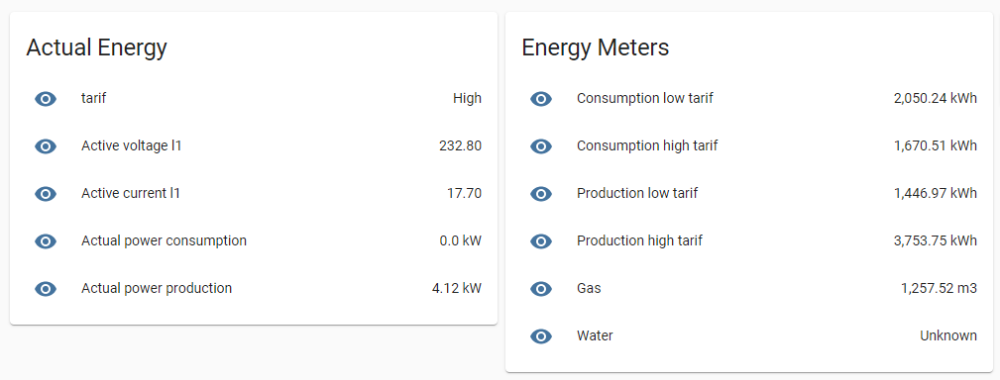

# Home Assistant


[Home Assitant](https://www.home-assistant.io/) is a open source home automation platform.

In this chapter we will be discribing how to import the MQTT data from your CDEM for displaying and automation purposes.


## Configure your MQTT broker

First you will need to provide the MQTT broker setup in your `configuration.yaml` file:

```yaml
# MQTT broker        
mqtt:
  broker: <your broker IP-adress>
  port: 1883
  client_id: home-assistant
  keepalive: 60
```
## Configure your sensors

Next you will need to add all sensors (the measurements from CDEM available in the MQTT broker).
This can be done in your `configuration.yaml` file or a seperate sensor file.

```yaml
# Consumption low tarif
- platform: mqtt
  name: "Consumption low tarif"
  unit_of_measurement: 'kWh'
  state_topic: "<your base topic>/consumption_low_tarif"
  unique_id: "consumption_low_tarif"
  value_template: "{{ value|float  }}"
```

## Configuring groups

Now that the CDEM information is made available you can visualise it by adding them to your `groups.yaml` file.

```yaml
actual_energy:
    name: Actual Energy
    entities:
      - sensor.tarif
      - sensor.active_voltage_l1
      - sensor.active_current_l1
      - sensor.actual_power_consumption_2
      - sensor.actual_power_production_2
energy_meters:
    name: Energy Meters
    entities:
      - sensor.consumption_low_tarif
      - sensor.consumption_high_tarif
      - sensor.production_low_tarif
      - sensor.production_high_tarif
      - sensor.gas
      - sensor.water
```

The result could be something like this:



## Automations

Next you can start adding some automations to make your home energy consumption better.
This can be done in the `automations.yaml` file.

See chapter [Energy Efficiency](/12_energysavings) for some suggestions on that.