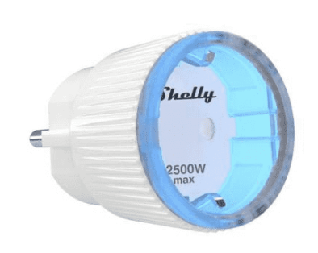
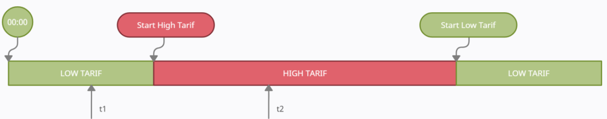
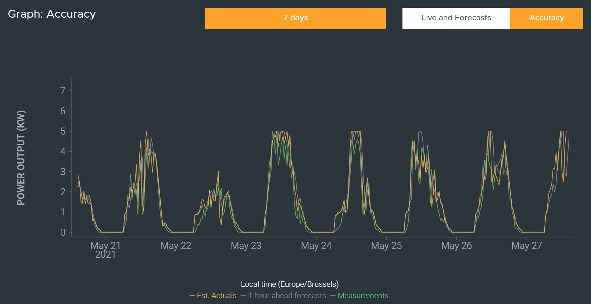
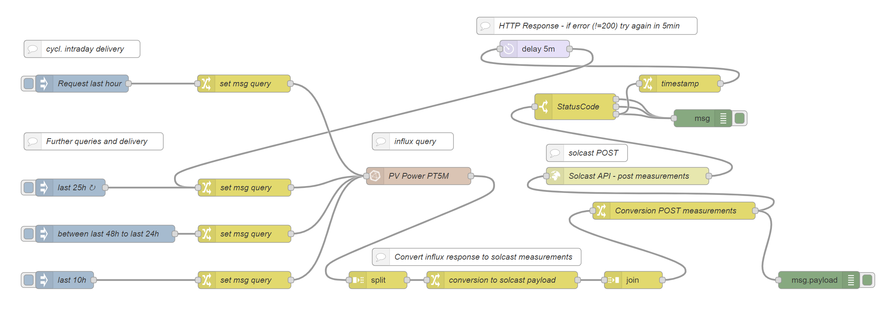
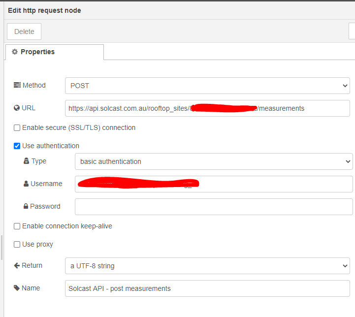
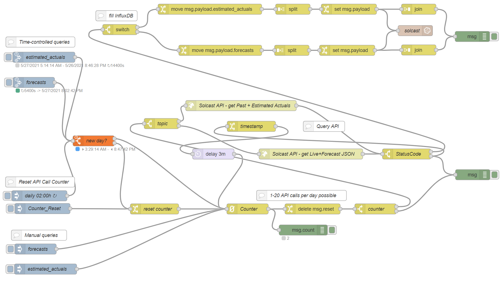
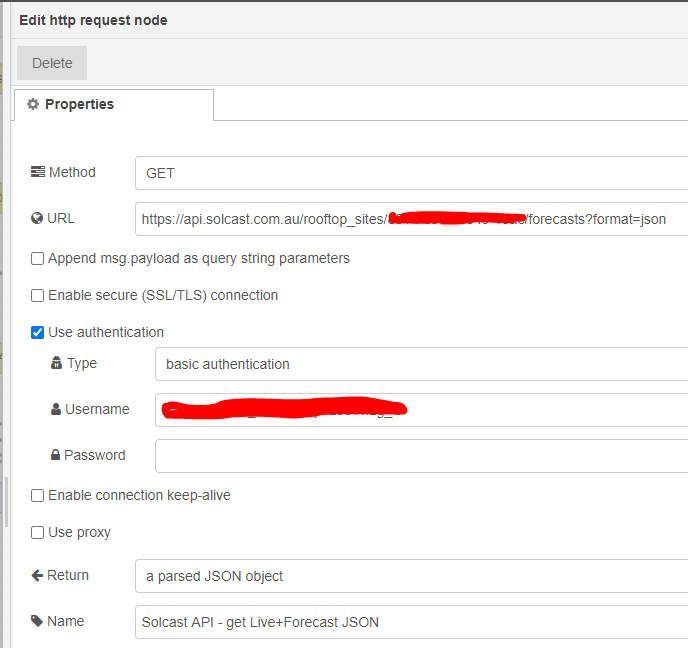
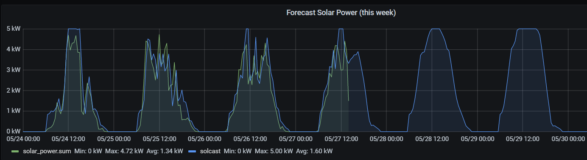

# Energy Efficiency

Things become interesting when you use the information from the Fluvius Smart Meter combined with other information from your home or third party's in order to automate some of your energy usage. The main goal here will be to use the energy more effeciently.

## Smart plug

You don't need a home automation system to achieve some level of automation at your home.
You can use switchable plugs that can be accessed via wifi.

A nice example is the [Shelly Plug](https://shelly.cloud/products/shelly-plug-s-smart-home-automation-device/).



This plug is supported by openHAB and Homeassistant so that automation by adding some rules is made easy.

## Smart use of large energy consumers that are critical in use

It would be smart to use large energy consumers that are critical in use like a boiler, freezer, ... when the energy is available at the lowest cost. The ideal moment is the use these devices when you are injecting energy into the net, if this is not possible then the next best thing is in low tarif.

One could set the following rules (example for a boiler):



@t1:
* Use a the weather prediction or solar forcast (see further in this chapter) to figure out if you can expect solar energy production or not.
* If you can't expect much solar energy production you switch on the boiler on.

@t2:
* If the boiler wasn't active @t1 then switch it on if there is sufficient energy injected into the net.

@Start low tarif:
* If the boiler hasn't been switched on today then switch it on.

To determine the t1 and t2 timestamps the boiler follow these instructions:
1. Wait until the start of low tariff and then unplug your boiler.
2. 24 hours later plug in your boiler and measure the amount of energy (P) needed to heat the water and the duration (t).
3. Now you calculate the t1 time like this t1 = end low tariff – (t + 0,5 hours)
4. Now you calculate the t2 time like this t2 = middle production time – (t/2 + 0,25 hours)

## Smart use of large energy consumers that are non-critical in use

Non-critical appliances like a diswasher, washing machine, ... should only be used when more then the needed energy for that devices is being injected into the net.

One could set the following rule:

@any given time:
* If the energy being injected into the net is larger then the needed energy for the appliance to run and the time < sunset – time needed for the appliance to run then switch the power plug for that device on and indicate on the dashboard that you can safely use that appliance.
* If your electric car is charging consider that amount of energy available. 

:::tip Note
You can use your electric car as buffer. If energy is being injected into the net, then use that energy in stead to charge your car. If a other non-critical device is started then stop charging your car unless there is still enough energy left to do that.
:::

## Predict your solar power production

In stead of using the weather prediction to estimate your solar power production you can use the API of [Solcast](https://solcast.com/rooftop-solar/). It's a nice service where you can define your solar power plant (as a hobbyist for free in a so called rooftop-site) and it and it comes with a [well documented API](https://docs.solcast.com.au).

There is also a so called "PV-Tuning" feature, which will allow you to feed back real power measurements from your installation to solcast and these will be used to adjust/tune the forecasts specifically for your installation.
This does include compensation of azimuth/angle of your setup, in case your real installation is different from a single rooftop with a fixed azimuth and angle, which is the only way to define your setup in the solcast rooftop account.

After approximately 10 days of feeding measurements to solcast, the prediction becomes pretty accurate:



### Feeding your measurements to solcast

Again we used Node-red to achive this. Offcourse in order to do this your solar inverter data must be available (for instance in influxDB). The destination is described in the [solcast API](https://docs.solcast.com.au/#measurements-rooftop-site).

This is a simple HTTP(S) request to the API, sending the data as an array in JSON format.
You can invoke the API-service as often as you want (it is not counting against the number of 20 allowed API calls per day with your free hobbyist rooftop account). Also re-sending measurements already sent earlier is not a problems, as these will simply be overridden.

We finally resorted to collect and send data for from the last 25hours in an interval once every 24hours.
The flow offers some predefined injection-nodes with dataseries from other time-spans, that can be invoked manually.

The flow for posting measurements to solcast looks like this:



The different influxDB queries are defined manually inside the change-nodes.
The minimum intervall that can be given for a measurement is 5minutes, which is what I choose in the queries.
This is the influxDb query for the 25hrs recurring collection interval:

```SQL
SELECT mean("value")  FROM "<your influxDB measurement>"
WHERE (time >= now()-25h AND time <= now()-7m)
GROUP BY time(5m) fill(0)
```

Measurements are expected in kW units, should your data bee in W then you will have to add `/1000` after the `mean("value")`. Also non existing data in that interval (when its dark, normally no solar data will be captured from the inverter) will be filled with "0" (number zero). You will need to select the correct measurement in your own query.

We noticed, that the solcast API-Service can be sometimes "flaky", so an API invocation might fail occasionally . We catched the HTTP-response and if not a status 200, the message gets recreated after 5mins....works every time so far.

Inside the HTTP-Request node, you will have to specify the URL and credentials.
The URL is based on/comprised of your rooftop account ID and you can use basic identification with the use of your solcast API-Token as Username. Both information you can easily get from your solcast account info.

This is what the setup of the node looks like:



You can download the Node-Red flow [here](/files/solcast-measurements.json).

### Retrieving solcast estimates/forecast

The flow for retrieving the forecasts is similar:



We are using a special inject node [node-red-contrib-sun-position](https://flows.nodered.org/node/node-red-contrib-sun-position/) where we can run a number of events between dates (sunrise/sundown).
The hobbyist rooftop account will allow for 20 queries per day, so a counter-node is introduced to match/route this requirement, while events are created using [node-red-contrib-counter](https://flows.nodered.org/node/node-red-contrib-counter).

Also other inject nodes are there to allow for manual injection and/or resetting the counter, which is nice for testing (during the first three month of your rooftop account, the limit will not be enforced until he first 1000 API-calls are used up).
Again, like in the measurement flow, of the API-call fails occasionally, a retry will be scheduled after 3mins. We found, that even when the call fails, the attempt will be counted against the number of calls, so the retry will increase the counter...just in case.

The API has two separate services, estimated actuals and forecasts.
The HTTP(S) node is configured similar, but with a GET Method and waiting/parsing a JSON response. using rooftop-id in the URL and API-Token as Username with basic authentication.



After a successful retrieval, the data (JSON array) gets re-formatted to be fed into the influxDB-node.
Here we opted to send each individual data point/message into the node. Our current influxDB and node-Red instance would easily cope with the "stress", but generating a single bulk-message for influxDB is certainly possible. A single API-Call will create 336 data points.

You can download the Node-Red flow [here](/files/solcast-estimates.json).

PV-Tuning kicks in only after some days of feeding measurements, but the results are pretty impressive.




