# Technical information

## What information is provided with the P1 port ?

The P1 port follows the [DSMR 5 standard](/files/dsmr5.pdf) of the Dutch Smart Meter, extended with the [e-Mucs specification](/files/emucs.pdf).

::: tip S1 Port
The Fluvius digital meter also has an S1 port. This user port (S1) is designed to provide "raw" data to an application (CEMS) at a particularly high frequency. The application must further process this "raw" data to make advanced calculations allowing for very detailed consumption feedback and control.
:::

### Physical connection

The `P1` port is a serial interface that uses a standard RJ12 connector.

::: tip RJ11 vs RJ12
The only difference between RJ11 and RJ12 is in how they are wired and the number of the wires that are being used. RJ12 is a 6P6C wiring standard. RJ11 is a 6P4C wiring standard and only has four wires connected and the remaining two slots are no longer used.
:::

For the CDEM device we need a **RJ12 cable** because we use the digital meter as power source.

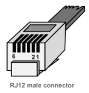

| Pin | Signal name |
| :---: | --- |
| 1   | + 5V (Power supply) |
| 2   | Data request        |
| 3   | Data GND (ground)   |
| 4   | Not connected       |
| 5   | Data                |
| 6   | GND (ground)        |

**Safety**

In order to protect both the user and the Fluvius digital meter, the `P1` port is galvanically isolated from the mains.

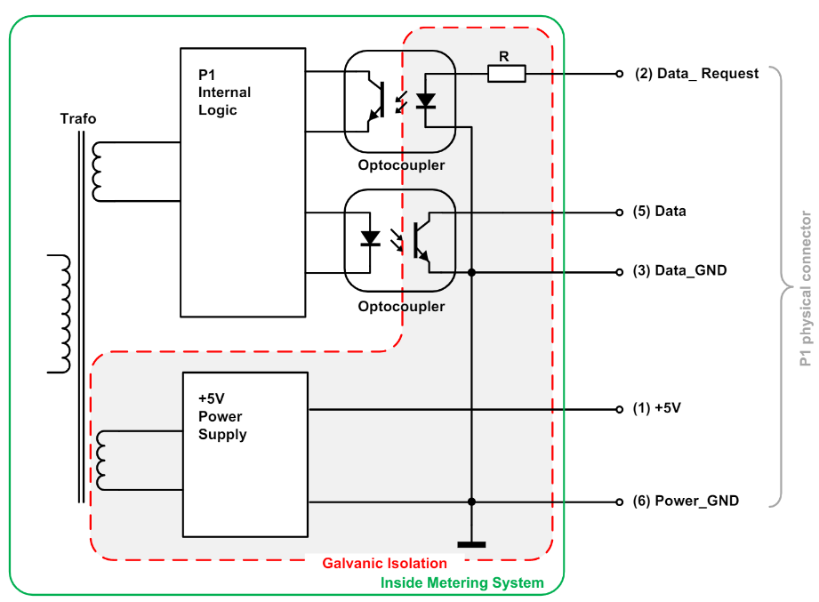

#### Power supply

The `P1` interface provides a stable `+5V DC` power supply via `pin 1` (5V) and `pin 6` (GND) to provide a connected IoT device with a power source.

U = 5,0 V ( max = 5,5 V with I = 0 mA , min = 4,9 V with I = 250 mA )

Here we run into our first problem. The maximum output for the power supply is 250 mA which is at the limit for booting a ESP12 chipset.

#### Data request

The P1 port is activated (will start sending data) by setting "Data request" (pin 2) high (4,0V to 5,5V). While receiving data, this line must be kept high.

::: warning Warning
To stop receiving data the "Data request" line must be put in a high impedance mode and must not be connected to the GND or 0V
:::

#### Data

Here we run into our second problem. Due to the use of opto couplers, the "Data" (pin 5) line must be designed as an **Open Collector** output and must be **logically inverted** before it can be used with IoT device ( Raspberry Pi, ESP12, Arduino, ...).

A "Data" line LOW has a voltage of 0,2 V (0 - 1V), HIGH has a voltage of 5,0V with a maximum current of 30 mA.

The solution is either to use a pre-made cable like for instance [this one](https://www.sossolutions.nl/slimme-meter-kabel), or to provide the signal inversion yourself.

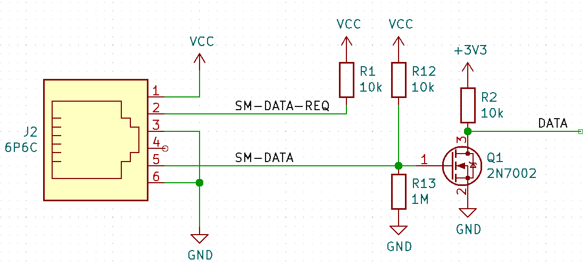

### Communication protocol

Here we run into our third problem. The P1 communication protocol of a Fluvius Smart Meter is based on the DSMR 5 standard used in the Netherlands but extended with the e-Mucs specifications. Therefore all solutions found on the internet for the Netherlands are not applicable for the Fluvius Smart Meter.

#### Transfert speed and character formatting

The interface must use a fixed transfer speed of 115200 baud. 

::: warning ❗ Cable length restriction
Due to the 115200 baud-rate the max. cable length for this serial communication is 2,5 m.
:::

The Fluvius Smart Meter sends its data to the connected IoT device every single second and the transmission of the entire P1 telegram is completed within 1s.

The format of transmitted data is defined as “8N1”. Namely:

- 1 start bit,
- 8 data bits,
- no parity bit and
- 1 stop bit.

#### Data readout

The Fluvius Smart Meter transmits the data message, as described below, immediately following the activation through the Request signal.

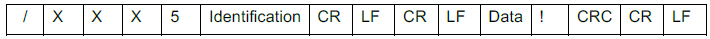

#### End of transmission

The data transmission is complete after the data message has been transmitted. An acknowledgement signal is not provided for.

#### Data objects

For more information on the OBIS codes see the [DSMR 5 standard](/files/dsmr5.pdf) and [e-Mucs specification](/files/emucs.pdf).

##### Electricity data

| OBIS reference | Value | Example |
|---|---|---|
| 0-0:96.1.1 | Equipment identifier | 0-0:96.1.1(4B384547303034303436333935353037) |
| 1-0:1.8.1 | Meter Reading electricity consumption (normal tariff) in 0,001 kWh | 1-0:1.8.1(123456.789*kWh) |
| 1-0:1.8.2 | Meter Reading electricity consumption (low tariff) in 0,001 kWh | 1-0:1.8.2(123456.789*kWh) |
| 1-0:2.8.1 | Meter Reading electricity injected (normal tariff) in 0,001 kWh | 1-0:2.8.1(123456.789*kWh) |
| 1-0:2.8.2 | Meter Reading electricity injected (low tariff) in 0,001 kWh | 1-0:2.8.2(123456.789*kWh) |
| 0-0:96.14.0 | Tariff indicator electricity. **(1=normal, 2=low)** | 0-0:96.14.0(0002) |
| 1-0:1.7.0 | Actual electricity power consumption in 1 Watt resolution | 1-0:1.7.0(01.193*kW) |
| 1-0:2.7.0 | Actual electricity power injected in 1 Watt resolution | 1-0:2.7.0(00.000*kW) |
| 0-0:96.7.21 | Number of power failures in any phases | 0-0:96.7.21(00004) |
| 0-0:96.7. 9 | Number of long power failures in any phases | 0-0:96.7.9(00002) |
| 1-0:99:97.0 | Power failure event log | 1-0:99.97.0(2)(0-0:96.7.19)(101208152415W)(0000000240*s)(101208151004W)(0000000301*s) |
| 1-0:32.32.0 | Number of voltage sags in phase L1 | 1-0:32.32.0(00002) |
| 1-0:52.32.0 | Number of voltage sags in phase L2 | 1-0:52.32.0(00001) |
| 1-0:72.32.0 | Number of voltage sags in phase L3 | 1-0:72.32.0(00000) |
| 1-0:32.36.0 | Number of voltage swells in phase L1 | 1-0:32.36.0(00000) |
| 1-0:52.36.0 | Number of voltage swells in phase L2 | 1-0:52.36.0(00003) |
| 1-0:72.36.0 | Number of voltage swells in phase L3 | 1-0:72.36.0(00000) |
| 1-0:32.7.0 | Instantaneous voltage L1 | 1-0:32.7.0(220.1*V) |
| 1-0:52.7.0 | Instantaneous voltage L2 | 1-0:52.7.0(220.2*V) |
| 1-0:72.7.0 | Instantaneous voltage L3 | 1-0:72.7.0(220.3*V) |
| 1-0:31.7.0 | Instantaneous current L1 | 1-0:31.7.0(001*A) |
| 1-0:51.7.0 | Instantaneous current L2 | 1-0:51.7.0(002*A) |
| 1-0:71.7.0 | Instantaneous current L3 | 1-0:71.7.0(003*A) |
| 1-0:21.7.0 | Instantaneous active power consumption L1 | 1-0:21.7.0(01.111*kW) |
| 1-0:41.7.0 | Instantaneous active power consumption L2 | 1-0:41.7.0(02.222*kW) |
| 1-0:61.7.0 | Instantaneous active power consumption L3 | 1-0:61.7.0(03.333*kW) |
| 1-0:22.7.0 | Instantaneous active power injected L1 | 1-0:22.7.0(04.444*kW) |
| 1-0:42.7.0 | Instantaneous active power injected L2 | 1-0:42.7.0(05.555*kW) |
| 1-0:62.7.0 | Instantaneous active power injected L3 | 1-0:62.7.0(06.666*kW) |
| 0-0:96.3.10 | Breaker state | 0-0:96.3.10(1) |
| 0-0:17.0.0 | Limiter treshold | 0-0:17.0.0(123.4*kW) |
| 1-0:31.4.0 | Fuse supervision threshold (L1) | 1-0:31.4.0(001*A) |

::: warning 🔥 Belgian vs Dutch meter
The Obis-references for High and Low tarif are switched for the Belgian meter compared to the Dutch meter!
**(1 = normal tarif , 2 = low tarif)**
:::

##### Messages

| OBIS reference | Value | Example |
|---|---|---|
| 0-0:96.1.4 | Version information | 0-0:96.1.4(50) |
| 0-0:96.13.0 | Text message max 1024 characters. | 0:96.13.0(303132333435363738393A3B3C3D3E3F3031) |
| 0-0:96.13.1 | Consumer message code | 0-0:96.13.1(3031203631203831) |

##### Gas data

| OBIS reference | Value | Example |
|---|---|---|
| 0-n:24.1.0 | Device-Type | 0-1:24.1.0(003) |
| 0-n:96.1.0 | Equipment identifier | 0-1:96.1.0(3232323241424344313233343536373839) |
| 0-n:24.2.1 | Last 5-minute value (temperature converted), gas delivered to client in m3, including decimal values and capture time | 0-1:24.2.1(101209112500W)(12785.123*m3) |
| 0-n:96.1.1 | M-Bus Device ID 2 |  0-1:96.1.1(3232323241424344313233343536373839) |
| 0-n:24.4.0 | Valve state | 0-1:24.4.0(1) |
| 0-n:24.2.3 | Last value of ‘not temperature corrected’ gas volume in m³, including decimal values and capture time | 0-1:24.2.3(101209112500W)(12785.123*m3) | 

##### Thermal data

| OBIS reference | Value | Example |
|---|---|---|
| 0-n:24.1.0 | Device-Type | 0-1:24.1.0(003) |
| 0-n:96.1.0 | Equipment identifier | 0-1:96.1.0(3232323241424344313233343536373839) |
|  0-n:24.2.1 | Last 5-minute Meter reading Heat or Cold in 0,01 GJ and capture time | 0-1:24.2.1(12.34*GJ) |

##### Water data

| OBIS reference | Value | Example |
|---|---|---|
| 0-n:24.1.0 | Device-Type | 0-1:24.1.0(003) |
| 0-n:96.1.0 | Equipment identifier | 0-1:96.1.0(3232323241424344313233343536373839) |
| 0-n:24.2.1 | Last 5-minute Meter reading in 0,001m3 and capture time | 0-1:24.2.1(12785.123*m3) |

::: warning 🔥 Warning
Be aware of the fact that the number of OBIS codes and the order of them is not fixed. Therefore the connected IoT device must be able to interpret the P1 telegram.
:::

## How is the hardware build ? 

### Version 1

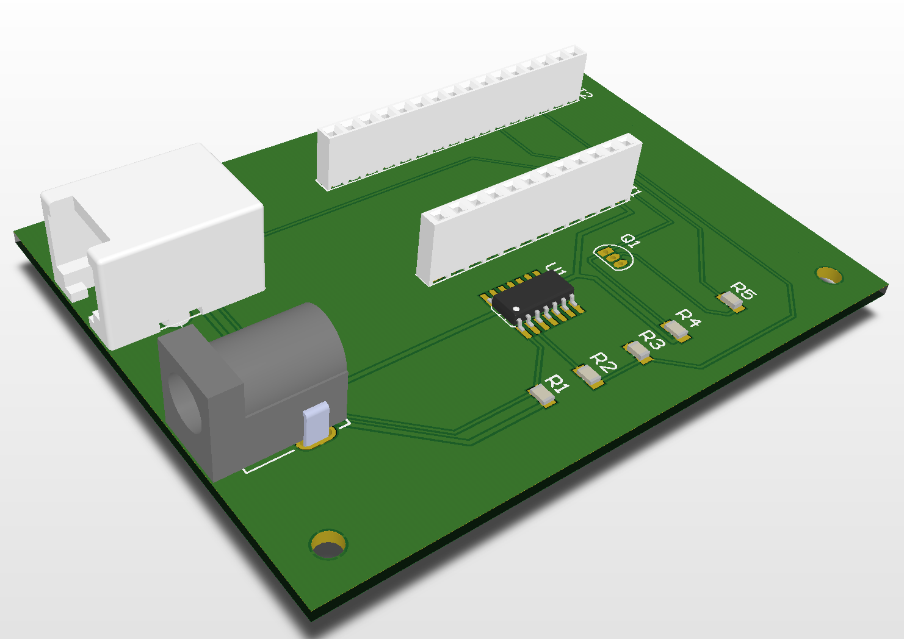

This is our [first prototype model](https://workspace.circuitmaker.com/Projects/Details/RonnyMees/FluviusMeterv1) to establish proof of concept, being able to read the P1 telegram from the Fluvius Digital Meter.

This pcb works in conjunction with the [Feather Huzzah 32](https://learn.adafruit.com/adafruit-huzzah32-esp32-feather).

### Version 2

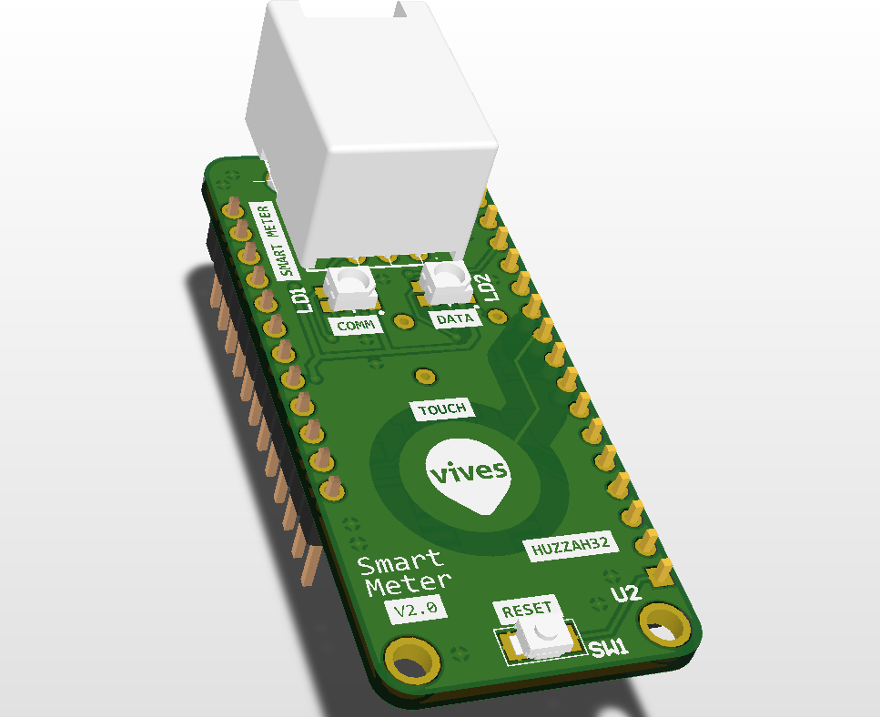

This is our [second prototype model](https://workspace.circuitmaker.com/Projects/Details/Nico-De-Witte/cdem) to establish proof of concept, provide a fully functional device that reads the P1 telegram from the Fluvius Digital Meter and publishes it toe a MQTT broker.

This pcb works in conjunction with the [Feather Huzzah 32](https://learn.adafruit.com/adafruit-huzzah32-esp32-feather).

### Version 3

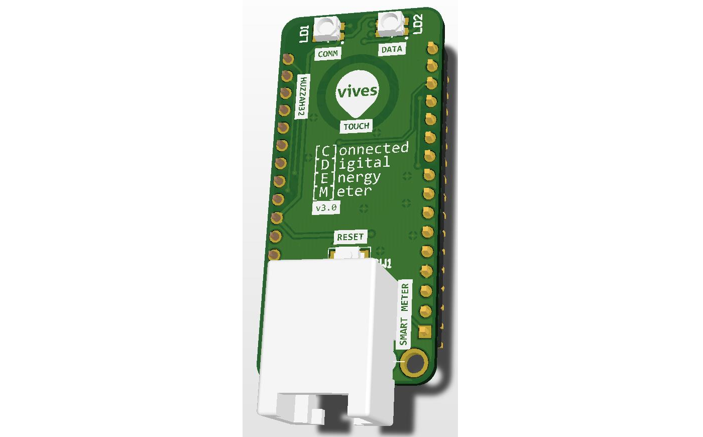

In the previous version the usb connector and the RJ12 connector where on opposite sides, therefore we made a [third prototype model]() that was a mirrored version of the second version. This model was never made.

This pcb works in conjunction with the [Feather Huzzah 32](https://learn.adafruit.com/adafruit-huzzah32-esp32-feather).

### Version 4

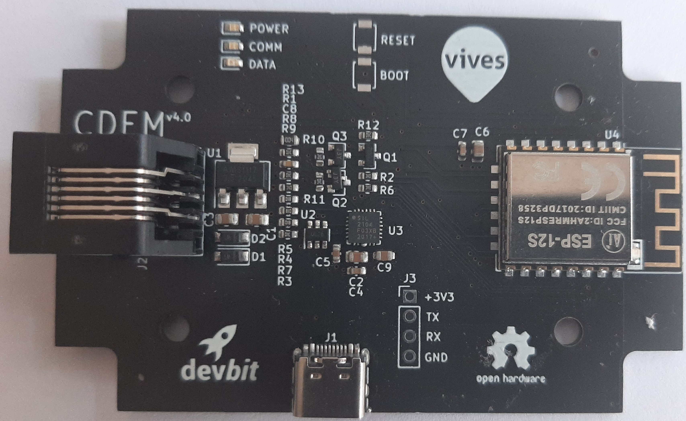

During a meeting with Fluvius we decided to build a new version that could work standalone (with the power provided by the Fluvius Digital Meter). Due to the powerlimitations we had to rethink our concept and look for low power consuming components to be able to build that [fourth prototype model](https://github.com/connected-digital-energy-meter/cdem-hardware).

### Version 5

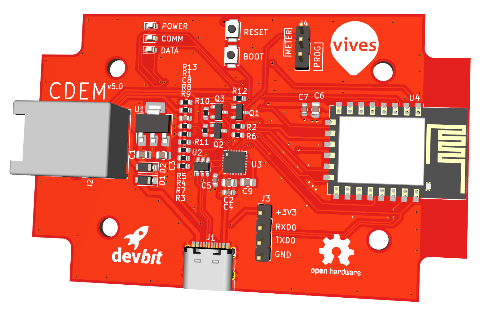

<!-- TODO : Github link toevoegen -->
Due to some power issue's and a fault we discoverd in the previous prototype we made a final version that solves this issue.

For the production version we provide some build information of the pcb.

**1. Connection to the Fluvius Meter**

We use the power supply provided from the Fluvius Meter (pin 1). The maximum output is 250 mA which is at the limit of what we need for our ESP12.
:::danger 🔌 Limited Power supply
Should your CDEM experience power problems and reboots often, then we advice to use an external USB power supply.
:::

**2. USB connection and UART bridge**

We have provided a usb connection on the PCB in order to be able to load the firmware via a UART bridge and provide a external power supply if necessary.

**3. Voltage regulator 5V to 3.3V**

<!--TODO: dit moet mogelijks nog aangepast worden naar een nieuwe versie -->

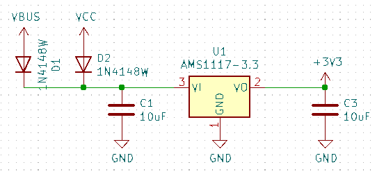

We have provided a voltage regulator that provides the board of 3.3V.

**4. Processor**

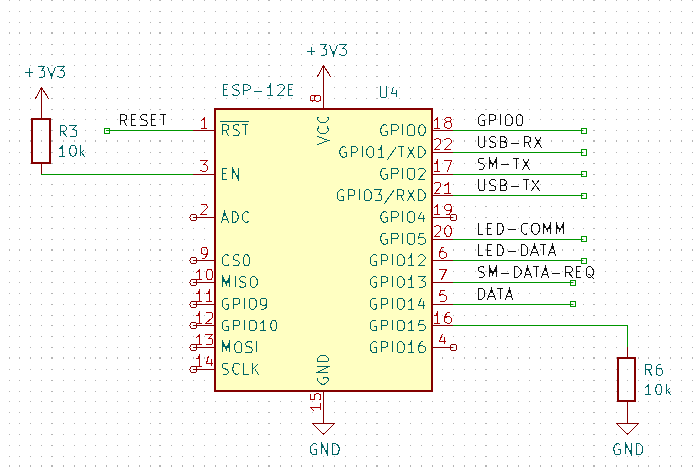

The heart of the board is a ESP-12E chipset that provides us with a processor and wifi module.

**5. Extra**

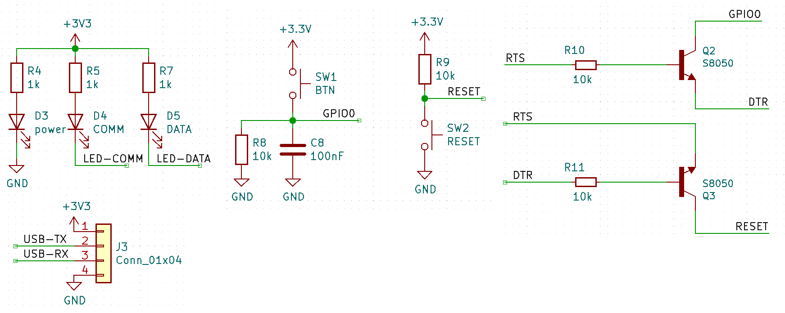

Finaly we also provided some small circuits for communication led's, push buttons and a jumper.

## How is the firmware build ? 

<!-- TODO: Hier komt de onwikkelinfo van de firmware -->

This flowchart explains the program structure of the firmware.

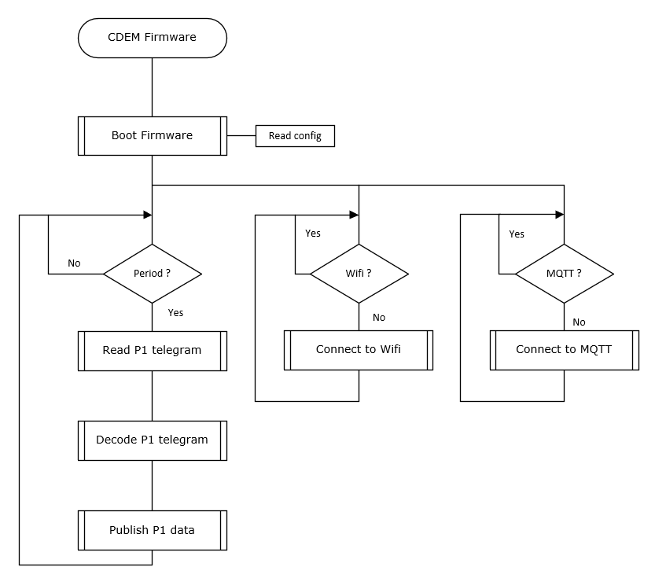