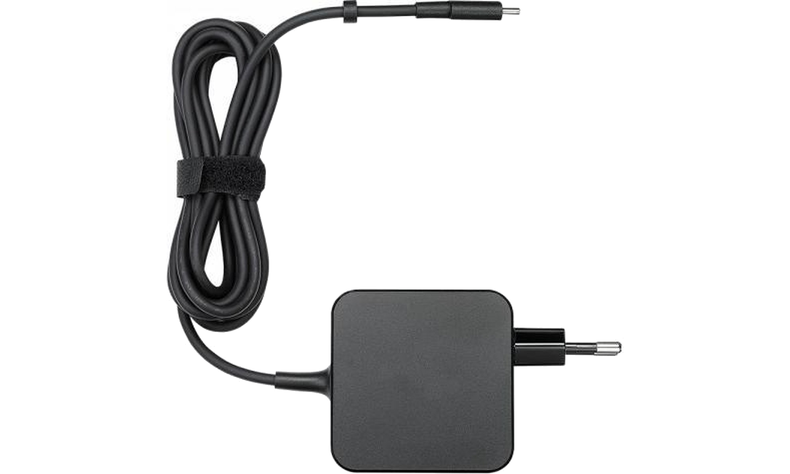
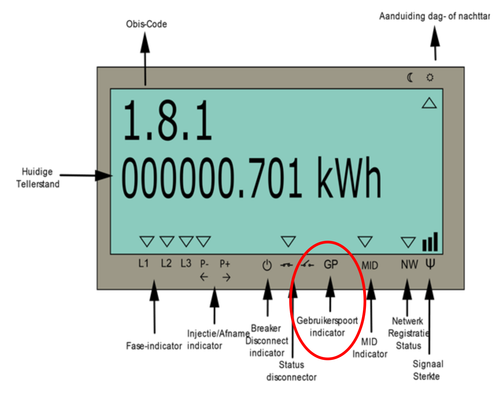

# Frequently Asked Questions

::: details Should I use a public MQTT broker?
It is our personal opinion that it is better practice to keep the MQTT data local instead of in the cloud. It's sensitive data that one could use to determine when nobody is at home. So we recommend not using a public MQTT broker.
:::

::: details How can i use this device to save on my energy bill?
* For starters you can use the output of your production ( if you have solar pannels ) and your consumption of energy to detect when u use most energy and at what tarif you use it. If you can figure out what devices or actions cause that energy usage you can adjust your habits so u use energy when it is least expensive for you.
* If you have a domotics system you can automate the above and cut the power to certain appliance when the energy price is high and your production is low.

More info is provided in the chapter [Energy Efficiency](/12_energysavings).
:::

::: details My CDEM is rebooting unexpectedly

When u notice that your CDEM is rebooting unexpectedly from time to time, then it may well be that the power supply of your Fluvius Meter is insufficient. We then advice you to use a external USB power supply to power your CDEM.

:::

::: details My DATA led keeps blinking orange

When the DATA led keeps blinking orange there is a problem with the communication between your CDEM device and the Fluvius Meter.

First check if you refitted the communicationsjumper.

If that's ok, then you probably have a faulty RJ12 cable. Just replace it.

:::

::: details I can't upload the firmware

First check if you have removed the communicationsjumper.

Also check if you are using the correct COM port.

If that's ok, then you probably have a faulty RJ12 cable. Just replace it.

:::

::: details General troubleshooting

If your setup doesn't do the expeceted you can folow these problem detecting steps:

1. Are both led's on your CDEM both green? If not:
   
   - check the cable connecting your CDEM with your digital meter
   - check if you have a wifi connection
   - check if your mqtt broker is up and running

2. Is the data being published to your MQTT broker?

   - check with MQTT Explorer if the data is being published

3. Is your influxdb and grafana running?

   - check if your influxdb and grafana is up and running.

4. Are you connected to internet?

   - Check if you have internet connection in your network. If not, it is possible that your network is unable to reach a DNS server and therefore has trouble locating your devices.

:::

<!-- ---------------------------------------------------------- -->

::: details Can I see if my user ports are activated?
Yes you can. Go to Fluvius digital meter and hit the lime green user button once. The display should become lit. A small arrow should be placed above G. If not, than your user ports are not activated.

:::

<!-- ---------------------------------------------------------- -->

::: details I am getting a lot of timeouts
If the timeouts counter in the `stats` topic is increasing, there might be a problem with the readout of the meter. Can have several causes:

* The Fluvius user ports are not activated (anymore). If this is a fresh setup you may need to wait a few days longer for the ports to become active. If this was a functioning setup, you need to check the digital meter.
* The RJ12 cable is faulty and may need to be replaced.
* The program jumper is not placed (correctly) on your CDEM device. Checkout the [Compile and Configure the Firmware](/03_firmware/#compile-and-upload-the-firmware) section for more information.
:::

<!-- TODO - Redirect to correct sections -->

<!-- ---------------------------------------------------------- -->

::: details Config page cannot be reached
If you get an error similar to `This site can't be reached` when trying to load the config page. Than check the following things:

* Is the COMM LED slowly blinking ? If not then the captive portal is not active. Reboot the device by unplugging it and plugging it back in.
* Are you connected to the CDEM-Config access point ? If not, then first connect to it.
* Did you disable your data-connection on your smartphone? If not, please do so.
* You may get this error if you are surfing to a URL that you have visited some time ago. Your smartphone is using it's DNS cache to resolve the URL. Try using another URL like for example [config.cdem.be](http://config.cdem.be).
:::

<!-- TODO - Redirect to correct sections -->

<!-- ---------------------------------------------------------- -->
