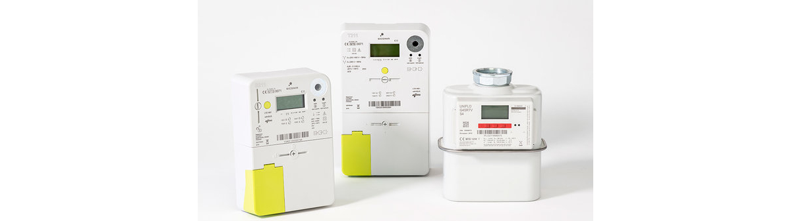

# IoT Opportunities - Connected Digital Energy Meter

As of July 2019 Fluvius has been installing digital meters all over Flanders. By July 2029, all families and SMEs must have a digital meter[1]. The fact that digital meters will not allow excess produced energy to be credited to the user in the near future has taken a lot of public attention. The next step in the evolution of our Belgian energy system is that as of June 2022 part of the netcost will be calculated based on "peakpower" usage[2]. Basically, users that use a lot of electricity for shorter periods will pay more netcosts than users that spread their energy consumption. Digital utility meters provide services such as automatic passing of meter reading, easy tarif switching, remote connecting and disconnecting from the energy network, automatic firmware upgrades, ...[3] Most importantly digital meters provide insight into a users energy consumption and allow homes to become more integrated and connected to the digital world. However, digital meters also come with serious challenges. Often these devices are labelled as "smart" devices, while at the time of this writing we can barely call them digital, let alone smart. While there are people ahead of the digital curve and have homes that are connected to the Internet of Things in every possible way, users who are less digitally connected often are left behind and never really get to the point where this digital source of information can become useful to them.

This brings us to the goal of this whole project: "Empower users and provide the tools in an open way so that users can become owners of the information the digital meters are providing. Give people the tools to build the smart solutions for the challenges of today and tomorrow". Start by becoming more conscious about your daily energy usage and/or production. By providing these tools in an open and free way, we also encourage people to build upon them and create solutions for common energy problems.

Our mission is fourfold and consists of the following phases:

1. Provide an open hardware platform to retrieve the user data from the digital meter and make the data available to the user in such a way that it can be visualized, interpreted and processed further without much effort.
2. Visualize the data in such a way that it becomes information for the user and provides insights into his/her daily electrical consumption and/or production.
3. Allow the user to act upon this information and construct solutions that improve their awareness of they handle energy usage.
4. Provide a stepping stone for automating these solutions and build a more digitally connected home.

<!-- FIGUUR! -->

In this project we provide an open hardware system called CDEM, Connected Digital Energy Meter, which allows the data of the digital meters to be readout and published via a common used messaging system called MQTT. Tools such as [Grafana](https://grafana.com/) allow dashboards to be build and provide insight into the raw data coming from the digital meter. By pulling your data in a home automation platform, such as [Home Assistant](https://www.home-assistant.io/) or [OpenHAB](https://www.openhab.org/), the information can be processed and used to take action.

All development information is made available with this documentation, open and free of charge. Our hope is that it gets picked up by the open  community and real-world solutions are built upon this. 

<!-- References -->
[1]: https://www.fluvius.be/nl/thema/meters-en-meterstanden/digitale-meter/wanneer-krijg-ik-een-digitale-meter
[2]: https://www.test-aankoop.be/woning-energie/gas-elektriciteit-mazout-pellets/nieuws/waarom-je-beter-je-stroomverbruik-spreidt-vanaf-2022
[3]: https://www.vlaanderen.be/bouwen-wonen-en-energie/zelf-energie-produceren/zonnepanelen-en-zonneboilers/de-digitale-energiemeter#wat-kunnen-digitale-meters-meer-dan-gewone-meters

## Research Project

**Connected Digital Energy Meter (CDEM)** is part of the PWO project **IoT Opportunities**, a research project of [VIVES University College](https://www.vives.be). The CDEM project is/was developed by:

* Nico De Witte
* Ronny Mees
* Sille Van Landschoot

**IoT Opportunities** is an initiative of [IoT Incubator](https://iot-incubator.be).

## Disclaimer

The use of this website (and of the information contained therein) is done solely at your own risk. The information on the website is general and not tailored to personal or specific  circumstances. The information on the website and its content are not binding. VIVES makes every effort to provide up-to-date and correct information, however it cannot be completely excluded that the content, information and technical documentation may contain  errors.

VIVES shall under no circumstances be held liable by anyone for direct or indirect damage (e.g. injuries, defects or costs) resulting from the use of the information on this website,  or arising from the impossibility of consulting this website, except those caused by gross negligence on the part of VIVES.  The proof of this gross negligence must be provided by the user.

Nor can VIVES be held liable for direct or indirect damage (e.g. injuries, defects or costs) resulting from the use of the content of a third-party website to which it refers.

## License

 This work is licensed under a <a rel="license" href="http://creativecommons.org/licenses/by-sa/4.0/">Creative Commons Attribution-ShareAlike 4.0 International License</a>.
